1. Introducing the box model
2. Understanding Margin Collapsing
3. Shorthand properties
4. Understanding box sizing
5. Adding header to the project
6. Understanding the display property
7. Adding Display Property to our project
8. Applying Display Property Stylign the navigation bar
9. Understanding an unexpected inline-block behaviour
10. Working with text decoration vertial-align
11. Styling anchor tags
12. Adding pseudo classes
13. Pseudo classes, pseudo elements
14. Grouping Rules
15. Working with font-weight border
16. Adding styling a CTA-button
17. Adding background image to our project
18. Properties worth to remember

Introducing the Box Model
-------------------------

would be nice to make red block bigger had more height more spacing inside of it, the whitepace around it want to get rid of it too

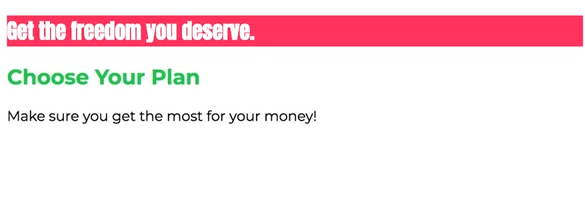

index.html

```html
<!DOCTYPE html>
<html lang="en">

<head>
    <meta charset="UTF-8">
    <meta http-equiv="X-UA-Compatible" content="ie=edge">
    <title>uHost</title>
    <link rel="shortcut icon" href="favicon.png">
    <link href="https://fonts.googleapis.com/css?family=Anton" rel="stylesheet">
    <link rel="stylesheet" href="main.css">
</head>

<body>
    <main>
        <section id="product-overview">
            <h1>Get the freedom you deserve.</h1>
        </section>
        <section id="plans">
            <h1 class="section-title">Choose Your Plan</h1>
        </section>
    </main>
</body>

</html>
```

main.css

```css
body {
    font-family: 'Montserrat';
}

#product-overview {
    background: #ff1b68;
}

.section-title {
    color: #2ddf5c;
}

#product-overview h1 {
    color: white;
    font-family: 'Anton' , sans-serif;
}
```

scroll to below the styles you will see the box- this is how css thinks about an element

1- content- whats inside the element - the blue element

2- padding- some internal space within that element from the content to the border

3- border- surrounds an element and comes after the padding 

4- margin- some spacing around the element, its not part of the main element, its the distance you have between that element and its next sibling

every element is interpreted as this box model they all have these layers

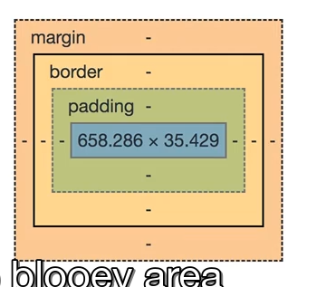

lets work with box model by working with product-overview section

lets add padding 20px;

```css
body {
    font-family: 'Montserrat';
}

#product-overview {
    background: #ff1b68;
    padding: 20px;
}

.section-title {
    color: #2ddf5c;
}

#product-overview h1 {
    color: white;
    font-family: 'Anton' , sans-serif;
}
```

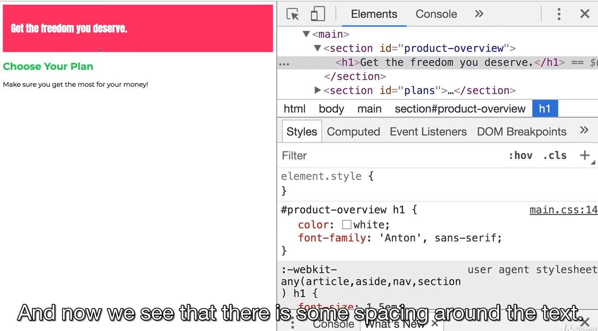

notice now that the padding is around the margin of the h1 tag, may look strange since this wasnt considered previously its jsut that if you add a padding then the content of the element is to be considered the content plus any margins it might have in this case the h1 has a margin so this is considered. because paddings and margins shouldnt overlape which is why the padidng is added after the margin of child elements

can also add a border 5px black solid

```css
body {
    font-family: 'Montserrat';
}

#product-overview {
    background: #ff1b68;
    padding: 20px;
    /*this is called a shorthand way of writing border style solid border color black border width 5px*/
    border: 5px black solid;
    margin: 20px;
}

.section-title {
    color: #2ddf5c;
}

#product-overview h1 {
    color: white;
    font-family: 'Anton' , sans-serif;
}
```

can finally add a margin of 20px

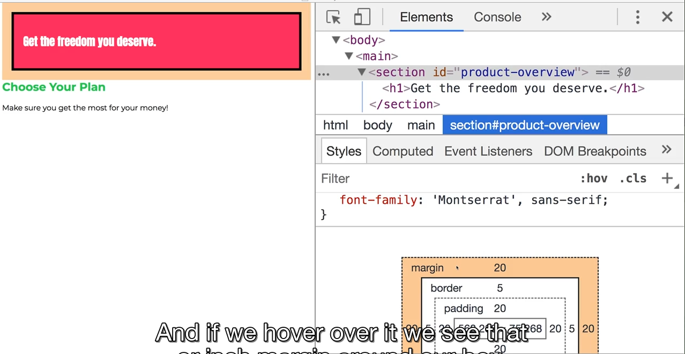

see some whitespace as well around the element we will get into that and explain that later

Understanding Margin Collapsing and Removing Default Margins
------------------------------------------------------------

lets inspect the section notice there is some whitespace to the left and to the right so after the orange margin

this is coming from the body can see the body has a default margin of 8px. this is coming from the browser defaults- if you hover over the body you will see the body has a default margin

the next special thing we can see is if we inspect the second h1 tag in our plans section- see it has a default margin of every h1 element has

if we also inspect the product overview section and look at the margin it kind of overlaps with the h1 margin

this is called margin collapsing

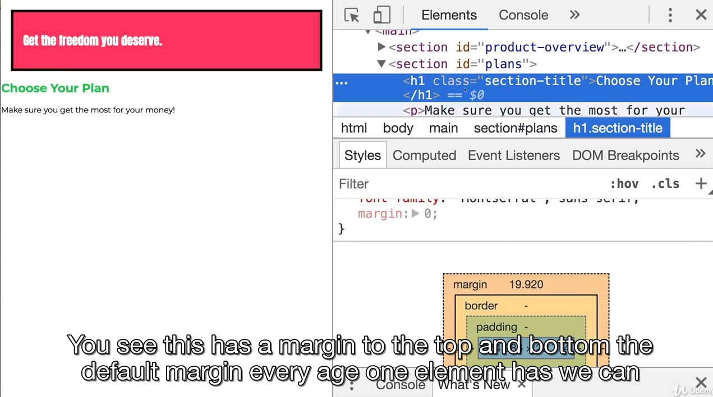

margin collapsing: if you have two block elements then margins between then are collapsed between them- the bigger marign wins. this is enforced by css to ensure you dont get too big distances between the elements

to work around this best to use either margin-top or margin-bottom unless you dont worry about this collapsing occuring which can also be the case

Understanding Shorthands in Action
----------------------------------

```css
body {
    font-family: 'Montserrat';
}

#product-overview {
    background: #ff1b68;
    padding: 20px;
    /*border-style: solid;*/
    /*border-color: black;*/
    /*border-width: 5px;*/
    /*this is called a shorthand way of writing border style solid border color black border width 5px*/
    border: 5px black solid;
    margin: 20px;
}

.section-title {
    color: #2ddf5c;
}

#product-overview h1 {
    color: white;
    font-family: 'Anton' , sans-serif;
}
```

in dev tools can click tiny arrow to expand the shorthand property and see what long form properties are combined

can see padidng can be split into padding-top padding-bottom padding-left and padding-right

Shorthand Properties
--------------------

shorthand properties combine values of multiple properties in a single property (the shorthand property)

sepertae properties:

```css
border-width: 2px;
border-style: dashed | solid
border-color: orange
```

Shorthand:

```css
border: 2px dashed orange; 
```

same for margin

```css
margin-top: 5px;
margin-right: 10px;
margin-bottom: 5px;
margin-left: 10px;

/*first one is the top second is right, then bottom, then last is left*/
margin: 5px 10px 5px 10px;

/* or margin top and bottom*/
margin: 5px 10px;
```

Diving into Height and Width
----------------------------

lets remove margin broder and padding of the product overview and set width and height

```css
body {
    font-family: 'Montserrat';
    margin: 0;
}

#product-overview {
    background: #ff1b68;
    /*width 100% tells to take full entire width of this page*/
    /*block level elements always take full width by default*/
    width: 100%;
    /*but if we set it to 50% then can see shrinks box to 50% of surrounding container*/
    /*can also set to 300px*/
}

.section-title {
    color: #2ddf5c;
}

#product-overview h1 {
    color: white;
    font-family: 'Anton' , sans-serif;
}
```

can also set height, if set height 100% and expect to get height of full page you will be sad it only gets a little bit bigger

```css
body {
    font-family: 'Montserrat';
    margin: 0;
}

#product-overview {
    background: #ff1b68;
    width: 700px;
    height: 100%;
}

.section-title {
    color: #2ddf5c;
}

#product-overview h1 {
    color: white;
    font-family: 'Anton' , sans-serif;
}
```

it only gets a little bigt bigger- the only thing it does now is it includes the height of the margin of the h1 element

100% refers to the height given by the parent container which in this case is the parent container BUT if hover over main element see its height is much bigger than the red container

but the height of the red container it is calculated dynamically by the content it holds so only as big as its content requires it to be

if wanted it to have an effect you would have to change the height of the main area too (the main section wraps the section with id of product overview

```css
main {
    height: 500px;
}

#product-overview {
    background: #ff1b68;
    width: 700px;
    height: 100%;
}
```

now the height of the product overview section will be 500px

need to create a chain 

could set it to an absolute value like 528px;

```css
main {
    height: 500px;
}

#product-overview {
    background: #ff1b68;
    width: 100%;
    height: 528px;
    padding: 10px;
    border: 5px solid black;
    margin: 10px;
}
```

Understanding Box Sizing and the Box Model
------------------------------------------

when we set height and width what did we change? did we set the height and width of the content, of the content plus padding? or content padding boded? contend padding border margin?

```css
body {
    font-family: 'Montserrat';
    margin: 0;
}

#product-overview {
    background: #ff1b68;
    width: 700px;
    height: 100%;
}

.section-title {
    color: #2ddf5c;
}

#product-overview {
    background: #ff1b68;
    width: 100%;
    height: 528px;
    padding: 10px;
    border: 5px solid black;
    margin: 10px;
}
```

using the code just above we can see that we set the width and height and padding and margin but notice it shifts to the right

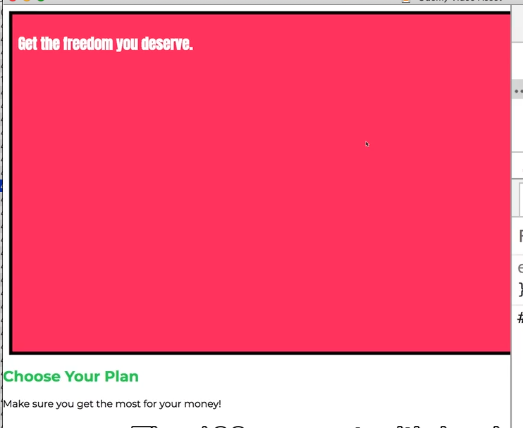

it goes out of the right side of our page

if inspect the section element

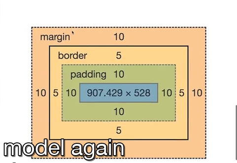

the height is 528 px for the content

the width is 100% of our content too but now the padding, border and margin add up to that 

the actual width is 937.43px

so the width includes the padding, border and margin 

and the actual height is 558px= 528 + padding top + padding bottom + border-top + border-bottom + margin-top + margin-bottom

so we set the height and width of the content. padding and border is not included in what width and height target

all elements by default have a certain way of calculating width and height which is called content-box

we can set this behaviour by setting the box-sizing property

```css
/*this is the default*/
/*means if we set width and height we set width and height of the content not of the entier box including the padding and border*/
 box-sizing: content-box;
/*now width and height include padding and border*/
/*they dont include the margin and we cant make it to include that*/
/*often this is the setting you want to use*/
 box-sizing: border-box;
/*this targets every element on its own*/
 * {
     box-sizing: border-box;
}
 
```

Adding Header to our Project
----------------------------

index.html

```html
<!DOCTYPE html>
<html lang="en">

<head>
    <meta charset="UTF-8">
    <meta http-equiv="X-UA-Compatible" content="ie=edge">
    <title>uHost</title>
    <link rel="shortcut icon" href="favicon.png">
    <link href="https://fonts.googleapis.com/css?family=Anton" rel="stylesheet">
    <link href="https://fonts.googleapis.com/css?family=Montserrat:400,700" rel="stylesheet">
    <link rel="stylesheet" href="main.css">
</head>

<body>
    <header class="main-header">
        <div>
            <a href="index.html">uHost</a>
        </div>
        <nav>
            <li class="main-nav__item">
                <a href="packages/index.html">Packages</a>
            </li>
             <li>
                <a href="customers/index.html">Customers</a>
            </li>
             <li>
                <a href="start-hosting/index.html">Start Hosting</a>
            </li>
        </nav>
    </header>
    
    <main>
        <section id="product-overview">
            <h1>Get the freedom you deserve.</h1>
        </section>
        <section id="plans">
            <h1 class="section-title">Choose Your Plan</h1>
            <p>Make sure you get the most for your money!</p>
        </section>
    </main>
</body>

</html>
```

main.css

```css
* {
    box-sizing: border-box;
}

body {
    font-family: 'Montserrat', sans-serif;
    margin: 0;
}

#product-overview {
    background: #ff1b68;
    width: 100%;
    height: 528px;
    padding: 10px;
    border: 5px solid black;
    margin: 10px;
    
}

.section-title {
    color: #2ddf5c;
}

#product-overview h1 {
    color: white;
    font-family: 'Anton', sans-serif;
}

/* h1 {
    font-family: sans-serif;
} */
```

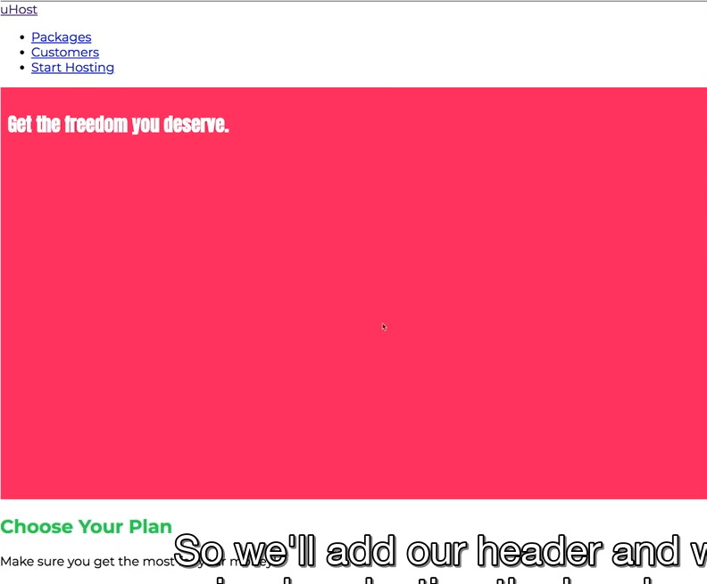

start by working on header

```css
header {
    
}
/*but might use multiple headers so best to add a classname */
/*want the header to span full width, green back color and give it padding so the content doesnt directly sit on its edges*/

.main-header {
    /*its a block level element so it takes the full entire width anyways*/
    width: 100%;
    background: #2ddf5c;
    padding: 8px 16px;
}
```

we get the green header and the text doesnt directly touch the edges anymore. but the ul doesnt look that great


Understanding the Display Property
----------------------------------

target the list items

```html
 <header class="main-header">
        <div>
            <a href="index.html">uHost</a>
        </div>
        <nav class="main-nav">
            <ul class="main-nav__items">
                 <li class="main-nav__item">
                     <a href="packages/index.html">Packages</a>
                 </li>
                 <li class="main-nav__item">
                     <a href="customers/index.html">Customers</a>
                 </li>
                  <li class="main-nav__item">
                     <a href="start-hosting/index.html">Start Hosting</a>
                 </li>
            </ul>
        </nav>
    </header>
```

The display property allows us to change the behaviour of an element from block to inline or even to inline block or none to remove it form the Dom

anchor tags are in-line which means if we have two of them they get rendered in the same line they dont take up 100% of the width

black elemenets take up 100% of the width - can change the behaviour with display property

```css
li {
 display: none;   
}
```

display none takes it out of the document flow but it still inside the dom so just gets removed from the visible document flow

its useful if we use it in conjunciton with javascript to show if after a button was clicked to show it after a button was clicked

this allows us to create modals whcih only show up on certain actions - smth we will also do later

can set our li to

```css
.main-nav__item {
    display: inline-block;
    padding: 20px;
}
```

like inline elements they can go next to each other but they still behave like block level elements when it comes to setting top and bottom margin, setting paddings, things that are not possible on inline elements

Applying the Display Property Styling to Our Application
--------------------------------------------------------

the problem atm is the div that holds our brand link is still on a different line than the nav- because div and nav elements are both block level elements and dont go intot the same link

ensure that both now sit in the same line

just going to practice combinator on the div

```css
.main-header >  div {
    display: inline-block;
}

/*need to add it to the nav element as well*/
.main-nav {
    display: inline-block;
    text-align: right;
}
```

now they are both side by side but want to move the nav items now to the right of the page

on the main-nav element we could use text-align: right on the but if we do that nothing changes BC ul sits inside nav which is a inline block level element so doesnt take up

so we need to set a width: the width should be the width of our header - width of the first div but there would be a problem still with the padding on the ul so reset than before setting the width of the main nav

```css
.main-header > div {
    display: inline-block;
}

.main-nav {
    display: inline-block;
    text-align: right;
    width: 100%;
}

.main-nav__items {
    margin: 0;
    /*setting padding to 0 and list-style none removes the bullet points*/
    padding: 0;
    list-style: none;
}
```

its on the right now but its also on a new line because we didnt remove the width of the fist div yet

scroll down and see it has a width of 48.134\. reading it from the rendered page is not the best possible approach tbh- we will will look at better options later now lets just say its 49px

function to help us

```css
.main-nav {
    display: inline-block;
    text-align: right;
    width: calc(100% - 49px);
}
```

it became narrower but its still in a new line- related to in

Understanding the Unexpected Inline-block Behaviour 
----------------------------------------------------

something related to display: inline-block- its the whitespace you have in yuor editor after the div and before the nav

its super dumb- but the empty whitespace is considered an extra character and is considered an extra inline element so you also have the width of the whitespace- what you can do is either remove it from your editor and it works but that is not that much fun

betetr way is to instead simply subtract a bit more- its abit hacky but a cleaner solution will be presented later in the course

Working with Text Decoration
----------------------------

```html
 <header class="main-header">
        <div class="main-header__div">
            <a href="index.html">uHost</a>
        </div>
        <nav class="main-nav">
            <ul class="main-nav__items">
                 <li class="main-nav__item">
                     <a href="packages/index.html">Packages</a>
                 </li>
                 <li class="main-nav__item">
                     <a href="customers/index.html">Customers</a>
                 </li>
                  <li class="main-nav__item">
                     <a href="start-hosting/index.html">Start Hosting</a>
                 </li>
            </ul>
        </nav>
    </header>
```

lets change color and change to bold and remove underline of the text logo

we are improting bold version of the font we improted from google so thats ok

```css
.main-header__div {
    text-decoration: none;
    color: #0e;
    font-weight: bold;
}
```

need to deduct 55 from main nav

may notice that the nav links on the right is not aligned in the middle perfectly anymore

it is aligned near the bottom

can add the property to the nav inline block element

we need to set it on both elements that need to be aligned tho not jus ton the nav but also on the div

the vertical align property sets the vertical alignment of an inline or table cell box

```css
.main-header__brand {
    display: inline-block;
    vertical-align: middle;
}

.main-nav {
    vertical-align: middle;
}
```

Styling Anchor Tags
-------------------

style the tags to have more sistance between them. keep in mind limited regaridng margin-top and bottom for inline block elements

add marign between the items here

top and bottom margin wont work always

```css
.main-nav__item {
    margin: 0 16px;
}

.main-nav__item a {
    text-decoration: none;
    color: #0e4f1f;
}
```

Pseudo Classes & Pseudo Elements
--------------------------------

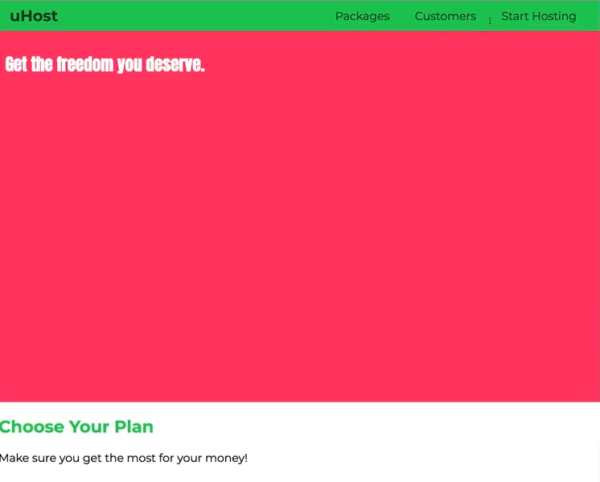

would be nice to make the links change their style when we hover over them or if we keep clicking on them

we use pseudo classes

```css
.main-nav__item a:hover {
   color: white;
}

/*active is when hold mouse presses*/
.main-nav__item a:active {
    color: white;
}
```

pseudo classes allow us to define a style for a special state of an element like hover or active state :class name

```css
:class name
```

pseudo elements allow us to define style of a specific part of an element ::element

```css
::element name
```

can find them on MDN website

example of psuedo elemeent is ::before and ::after

lets say in the parapgrah “make sure you get the most for your money” want to change the first letter

```css
p:first-letter {
    color: red;
    font-size: 20px;
}
```

the after and before elements are very interesting becuase they allow you to render content through css- this should only be content that adds to the design- for ex we can mark links in a certian way

here can specify content we want to add to the DOM

```css
.main-nav_item a::after {
    content: " (Link)";
    color: red;
}
```

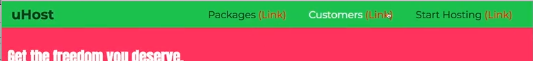

Grouping Rules
--------------

with css rules that are similar we can group them together into one rule

```css
.main-nav__item a:hover,
.main-nav__item a:active {
    color: white;
}
```

Working With Font-Weight Border
-------------------------------

want to set links to be bold, and have a broder at the bottom with padding in between

```css
.main-nav_item a {
    font-weight: bold;
    padding: 3px 0;
}
.main-nav__item a:hover,
.main-nav__item a:active {
     color: white;
     border-bottom: 5px solid white;
}
```

also want to add something just for the last link in the list

Styling Last List Item into call to action button
-------------------------------------------------

going to add a class to it

```html
 <header class="main-header">
        <div class="main-header__div">
            <a href="index.html">uHost</a>
        </div>
        <nav class="main-nav">
            <ul class="main-nav__items">
                 <li class="main-nav__item">
                     <a href="packages/index.html">Packages</a>
                 </li>
                 <li class="main-nav__item">
                     <a href="customers/index.html">Customers</a>
                 </li>
                  <li class="main-nav__item main-nav__item--cta">
                     <a href="start-hosting/index.html">Start Hosting</a>
                 </li>
            </ul>
        </nav>
    </header>
```

main.css

```css
.main-nav_item a {
    font-weight: bold;
    padding: 3px 0;
}

/*both have same level of specificity so now its really just the order in the file that matters to overide the parts we want*/
.main-nav__item--cta a {
    color: white;
    background: #ff1b68;
    padding: 8px 16px;
    border-radius: 8px;
}

/*invert the colors remove the white border bottom*/
.main-nav__item--cta a:hover,
.main-nav__item--cta a:active,{
    color: #ff1b68;
    background: white;
    border: none;
}
```

Adding Background Image to Our Project
--------------------------------------

atatched to project is an image freedom.jpg

can add it as a background image to product overview by removing the color assignment and using background: url assignment

```css
#product-overview {
    /* add path to image can be http or a subfolder */
    background: url("freedom.jpg")
    height: 528px;
    padding: 10px;
}
```

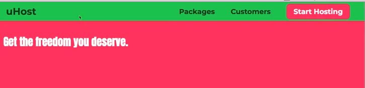


Properties Worth to Remember
----------------------------

properties are the part in front of the colon

```css
color: to change text color
background-color: to change background color
display: change the way it posoitions or behaves eg inline-block
padding: add distance between content and border
border:
margin: add spacing around a box
width:
height:
```

Final Code For this Chapter
---------------------------

```html
<!DOCTYPE html>
<html lang="en">

<head>
    <meta charset="UTF-8">
    <meta http-equiv="X-UA-Compatible" content="ie=edge">
    <title>uHost</title>
    <link rel="shortcut icon" href="favicon.png">
    <link href="https://fonts.googleapis.com/css?family=Anton" rel="stylesheet">
    <link href="https://fonts.googleapis.com/css?family=Montserrat:400,700" rel="stylesheet">
    <link rel="stylesheet" href="main.css">
</head>

<body>
    <header class="main-header">
        <div>
            <a href="index.html" class="main-header__brand">
                uHost
            </a>
        </div>
        <nav class="main-nav">
            <ul class="main-nav__items">
                <li class="main-nav__item">
                    <a href="packages/index.html">Packages</a>
                </li>
                <li class="main-nav__item">
                    <a href="customers/index.html">Customers</a>
                </li>
                <li class="main-nav__item main-nav__item--cta">
                    <a href="start-hosting/index.html">Start Hosting</a>
                </li>
            </ul>
        </nav>
    </header>
    <main>
        <section id="product-overview">
            <h1>Get the freedom you deserve.</h1>
        </section>
        <section id="plans">
            <h1 class="section-title">Choose Your Plan</h1>
            <p>Make sure you get the most for your money!</p>
        </section>
    </main>
</body>

</html>
```

main.css

```css
* {
    box-sizing: border-box;
}

body {
    font-family: 'Montserrat', sans-serif;
    margin: 0;
}

#product-overview {
    background: url("freedom.jpg");
    width: 100%;
    height: 528px;
    padding: 10px;   
}

.section-title {
    color: #2ddf5c;
}

#product-overview h1 {
    color: white;
    font-family: 'Anton', sans-serif;
}

/* h1 {
    font-family: sans-serif;
} */

.main-header {
    width: 100%;
    background: #2ddf5c;
    padding: 8px 16px;
}

.main-header > div {
    display: inline-block;
    vertical-align: middle;
}

.main-header__brand {
    color: #0e4f1f;
    text-decoration: none;
    font-weight: bold;
    font-size: 22px;
}

.main-nav {
    display: inline-block;
    text-align: right;
    width: calc(100% - 74px);
    vertical-align: middle;
}

.main-nav__items {
    margin: 0;
    padding: 0;
    list-style: none;
}

.main-nav__item {
    display: inline-block;
    margin: 0 16px;
}

.main-nav__item a {
    text-decoration: none;
    color: #0e4f1f;
    font-weight: bold;
    padding: 3px 0;
}

.main-nav__item a:hover,
.main-nav__item a:active {
    color: white;
    border-bottom: 5px solid white;
}

.main-nav__item--cta a {
    color: white;
    background: #ff1b68;
    padding: 8px 16px;
    border-radius: 8px;
}

.main-nav__item--cta a:hover,
.main-nav__item--cta a:active {
    color: #ff1b68;
    background: white;
    border: none;
}
```


