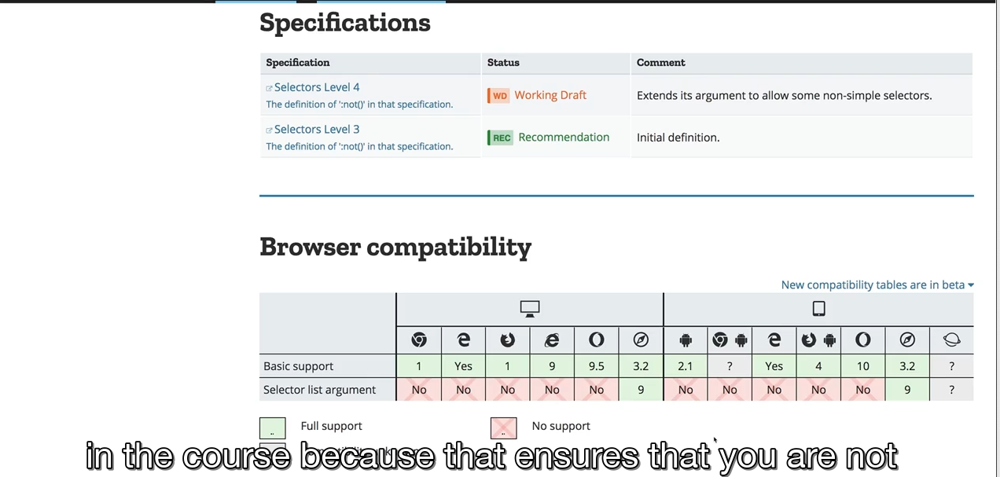
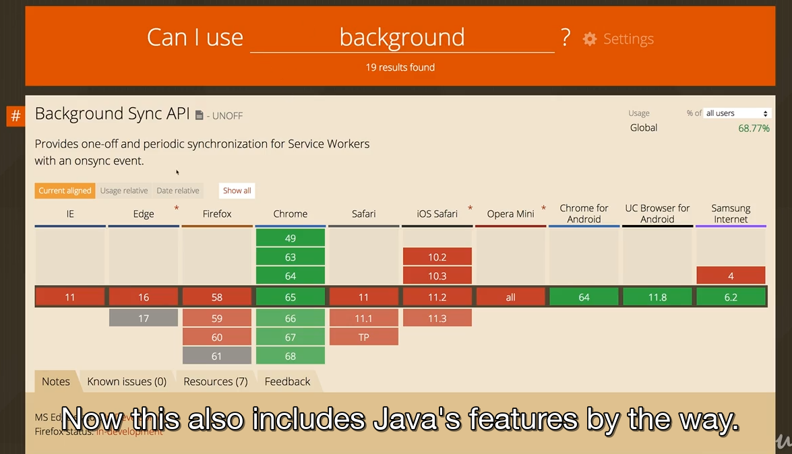

Using Multiple CSS Classes Combined Selectors
---------------------------------------------

```html
<div class="class1 class2"></div>

<a class="#" class="active"></a>
```

can use multiple classes on one element

```css
.class1 {}
.class2 {}
```

if you have two classes applied to the same element and they both happen to set a certain style on the element then the normal specificty and rules will apply

```css
a.active {}
```

```html
<!DOCTYPE html>
<html lang="en">

<head>
    <meta charset="UTF-8">
    <meta name="viewport" content="width=device-width, initial-scale=1.0">
    <meta http-equiv="X-UA-Compatible" content="ie=edge">
    <title>CSS Course</title>
    <link rel="stylesheet" href="main.css">
</head>

<body>
    <nav>
        <a href="#intro" class="active">Intro</a>
        <a href="#outro">Outro</a>
    </nav>
    <section id="intro" class="main-section highlighted">
        <p>This is the intro section.</p>
    </section>
    <section id="outro" class="main-section">
        <p>This is the outro section.</p>
    </section>
</body>

</html>
```

```css
body {
    font-family: sans-serif;
}

nav {
    margin-bottom: 16px;
    background: #fa923f;
    padding: 8px 0;
}

a {
    text-decoration: none;
    color: white;
    margin: 10px;
}

/*the main section sets a border */
.main-section {
    height: 800px;
    border: 1px solid #ccc;
    padding: 16px;
}

.highlighted {
    border: 2px solid #fa923f;
}
```

if we reload the page you see it gets the orange border - the highlighted class wins because it is defined later in the file

Classes or ID's
---------------

classes are re-usable, allow you to name things for syling purposes only, allow you to mark and name things for styling purposes only, should be first pick for first pick

id’s give you less control, only used once per page, keep in mind also id’s also can be used for link (non css meaning)

use a class instead even if you just want to apply one class

in the above html code the broswer will jump to the link ‘Outro’ this is a built in html feature

(NOT) Using Important
---------------------

```css
div {
    color: red !important;
}
```

important overides specifity and all other selectors. therefore this decoration would always be applied- you shouldnt really use it bc you are overiding and leads to bad code- some edge cases where using it is fine

Selecting the Opposite with not()
---------------------------------

this is a pseudo class. it allwos us to basically reverse a certain rule or exclude a certain selector

```css
/*selects any element that is NOT a paragraph*/
:not(p){
    color: blue;
}
```

```css
/*selects any anchor tags that dont have the class active*/
a :not(active){
    color: blue;
}
```

Broswer Support
---------------

whenever use special feature in CSS, check if the browsers of target audience supprot that feature otherwise you cant use it

bottom of MDN is browser compatibiility



can also use caniuse.com which includes javascript features

