starting index.html

```html
<!DOCTYPE html>
<html lang="en">

<head>
    <meta charset="UTF-8">
    <meta http-equiv="X-UA-Compatible" content="ie=edge">
    <title>uHost</title>
    <link rel="shortcut icon" href="favicon.png">
    <link href="https://fonts.googleapis.com/css?family=Anton" rel="stylesheet">
    <link href="https://fonts.googleapis.com/css?family=Montserrat:400,700" rel="stylesheet">
    <link rel="stylesheet" href="main.css">
</head>

<body>
    <header class="main-header">
        <div>
            <a href="index.html" class="main-header__brand">
                uHost
            </a>
        </div>
        <nav class="main-nav">
            <ul class="main-nav__items">
                <li class="main-nav__item">
                    <a href="packages/index.html">Packages</a>
                </li>
                <li class="main-nav__item">
                    <a href="customers/index.html">Customers</a>
                </li>
                <li class="main-nav__item main-nav__item--cta">
                    <a href="start-hosting/index.html">Start Hosting</a>
                </li>
            </ul>
        </nav>
    </header>
    <main>
        <section id="product-overview">
            <h1>Get the freedom you deserve.</h1>
        </section>
        <section id="plans">
            <h1 class="section-title">Choose Your Plan</h1>
            <p>Make sure you get the most for your money!</p>
        </section>
    </main>
</body>

</html>
```

```css
* {
    box-sizing: border-box;
}

body {
    font-family: 'Montserrat', sans-serif;
    margin: 0;
}

#product-overview {
    background: url("freedom.jpg");
    width: 100%;
    height: 528px;
    padding: 10px;   
}

.section-title {
    color: #2ddf5c;
}

#product-overview h1 {
    color: white;
    font-family: 'Anton', sans-serif;
}

/* h1 {
    font-family: sans-serif;
} */

.main-header {
    width: 100%;
    background: #2ddf5c;
    padding: 8px 16px;
}

.main-header > div {
    display: inline-block;
    vertical-align: middle;
}

.main-header__brand {
    color: #0e4f1f;
    text-decoration: none;
    font-weight: bold;
    font-size: 22px;
}

.main-nav {
    display: inline-block;
    text-align: right;
    width: calc(100% - 74px);
    vertical-align: middle;
}

.main-nav__items {
    margin: 0;
    padding: 0;
    list-style: none;
}

.main-nav__item {
    display: inline-block;
    margin: 0 16px;
}

.main-nav__item a {
    text-decoration: none;
    color: #0e4f1f;
    font-weight: bold;
    padding: 3px 0;
}

.main-nav__item a:hover,
.main-nav__item a:active {
    color: white;
    border-bottom: 5px solid white;
}

.main-nav__item--cta a {
    color: white;
    background: #ff1b68;
    padding: 8px 16px;
    border-radius: 8px;
}

.main-nav__item--cta a:hover,
.main-nav__item--cta a:active {
    color: #ff1b68;
    background: white;
    border: none;
}
```

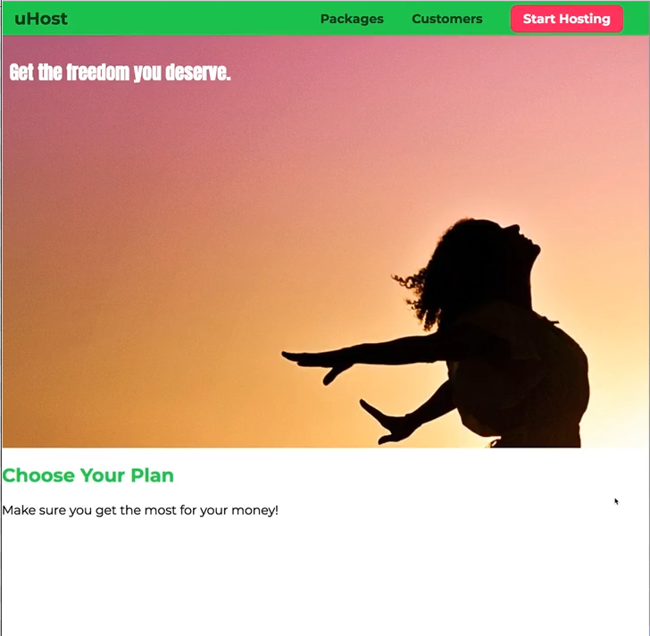

want to work on the plans section - needs more content- lets add it

```html
<!DOCTYPE html>
<html lang="en">

<head>
    <meta charset="UTF-8">
    <meta http-equiv="X-UA-Compatible" content="ie=edge">
    <title>uHost</title>
    <link rel="shortcut icon" href="favicon.png">
    <link href="https://fonts.googleapis.com/css?family=Anton" rel="stylesheet">
    <link href="https://fonts.googleapis.com/css?family=Montserrat:400,700" rel="stylesheet">
    <link rel="stylesheet" href="shared.css">
    <link rel="stylesheet" href="main.css">
</head>

<body>
    <header class="main-header">
        <div>
            <a href="index.html" class="main-header__brand">
                uHost
            </a>
        </div>
        <nav class="main-nav">
            <ul class="main-nav__items">
                <li class="main-nav__item">
                    <a href="packages/index.html">Packages</a>
                </li>
                <li class="main-nav__item">
                    <a href="customers/index.html">Customers</a>
                </li>
                <li class="main-nav__item main-nav__item--cta">
                    <a href="start-hosting/index.html">Start Hosting</a>
                </li>
            </ul>
        </nav>
    </header>
    <main>
        <section id="product-overview">
            <h1>Get the freedom you deserve.</h1>
        </section>
        <section id="plans">
            <h1 class="section-title">Choose Your Plan</h1>
            <div class="plan__list">
                <article class="plan">
                    <h1 class="plan__title">FREE</h1>
                    <h2 class="plan__price">$0/month</h2>
                    <h3>For hobby projects or small teams.</h3>
                    <ul class="plan__features">
                        <li class="plan__feature">1 Workspace</li>
                        <li class="plan__feature">Unlimited Traffic</li>
                        <li class="plan__feature">10GB Storage</li>
                        <li class="plan__feature">Basic Support</li>
                    </ul>
                    <div>
                        <button class="button">CHOOSE PLAN</button>
                    </div>
                </article>
                <article class="plan plan--highlighted">
                    <h1 class="plan__annotation">RECOMMENDED</h1>
                    <h1 class="plan__title">PLUS</h1>
                    <h2 class="plan__price">$29/month</h2>
                    <h3>For ambitious projects.</h3>
                    <ul class="plan__features">
                        <li class="plan__feature">5 Workspaces</li>
                        <li class="plan__feature">Unlimited Traffic</li>
                        <li class="plan__feature">100GB Storage</li>
                        <li class="plan__feature">Plus Support</li>
                    </ul>
                    <div>
                        <button class="button">CHOOSE PLAN</button>
                    </div>
                </article>
                <article class="plan">
                    <h1 class="plan__title">PREMIUM</h1>
                    <h2 class="plan__price">$99/month</h2>
                    <h3>Your enterprise solution.</h3>
                    <ul class="plan__features">
                        <li class="plan__feature">10 Workspaces</li>
                        <li class="plan__feature">Unlimited Traffic</li>
                        <li class="plan__feature">Unlimited Storage</li>
                        <li class="plan__feature">Priority Support</li>
                    </ul>
                    <div>
                        <button class="button">CHOOSE PLAN</button>
                    </div>
                </article>
            </div>
        </section>
        <section id="key-features">
            <h1 class="section-title">Many Good Reasons to Stick Around</h1>
            <ul class="key-feature__list">
                <li class="key-feature">
                    <div class="key-feature__image">

                    </div>
                    <p class="key-feature__description">3,857,000 Trusting Customers</p>
                </li>
                <li class="key-feature">
                    <div class="key-feature__image">

                    </div>
                    <p class="key-feature__description">99.999% Uptime Guarantee</p>
                </li>
                <li class="key-feature">
                    <div class="key-feature__image">

                    </div>
                    <p class="key-feature__description">Lightning Fast CDN</p>
                </li>
            </ul>
        </section>
    </main>
    <footer class="main-footer">
        <nav>
            <ul class="main-footer__links">
                <li class="main-footer__link">
                    <a href="#">Support</a>
                </li>
                <li class="main-footer__link">
                    <a href="#">Terms of Use</a>
                </li>
            </ul>
        </nav>
    </footer>
</body>

</html>
```

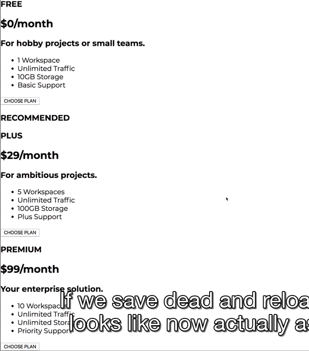

we want to make it look like this...

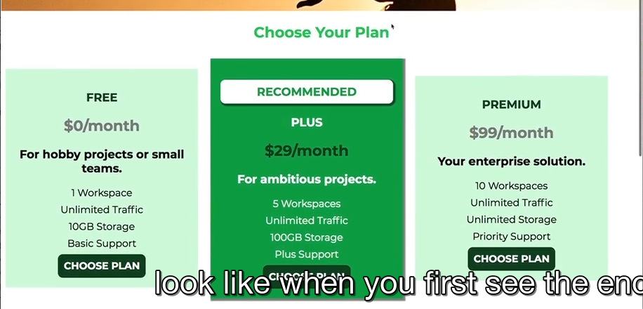

```css
.section-title{
    /*content of section title will be centered in its line */
    text-align: center;
}

.plan {
    background: #d5ffdc;
    text-align: center;
    padding: 16px;
    margin: 8px;
    /*want all plans to sit on same row*/
    display: inline-block
    /*limit width to 30% of surrounding container*/
    width: 30%;
    vertical-align: middle;
}
```

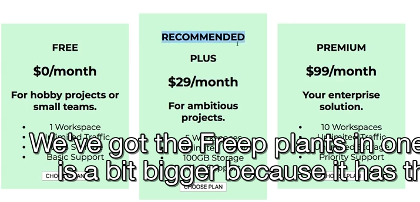

looks better- middle one bigger becuase it has extra ‘recommended’ text

want to ensure now the plan in the middle looks different going to add another class to the article element for the second plan

```css
.plan--highlighted {
    background: #19b84c;
    text-color: white;
    /*add drop shadow behind the plan*/
    /*allows you to define shaddow*/
    /*first is the x axis then the second is the y axis*/
    /*then can define the bluriness 2px */
    /*then the spread- how much the shadow should spread beyond the borders*/
    /*then the shaddow color*/ 
    /*can use a color function here*/
    box-shadow: 2px 2px 2px 2px rgba(255,255,255, 0.5);
}
```

there is an alternative to rgb which is rgba which allows you to add a fourth argument, the alpha channel- which allows to set the transparency. 0.5 means 50% transparent

Styling the Badge With Border-radius
------------------------------------

now working on recommended badge

```css
/*want the annotation to sit in white box and have tiny box shaddow*/
/*this is the h1 element witht his class*/
.plan__annotation {
    background: white;
    color: #19b48c;
    padding: 8px;
    box-shadow:  2px 2px 2px 2px rgba(255,255,255, 0.5);
    /*round the corners*/
    /*this applied to all four sides*/
    border-radius: 8px;
}
```

Styling Our List
----------------

```css
.plan__features {
    list-style: none;
    margin: 0;
    padding: 0;
}
```

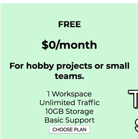

now just want to add some space between the list items

```css
.plan__features li {
    
}

/*or add a class to each list item such as plan__feature*/
/*adding class is a bit cleaner*/
```

Working on the Title and Price of Package
-----------------------------------------

these are h1 and h2 tags

```css
.plan__title {
    color: #0e4f1f;
}

.plan__price {
    color: #ccc;
}

.plan--hilighted .plan-price {
    color: #0e4f1f;
}

.plan--hilighted .plan-title {
    color: white;
}
```

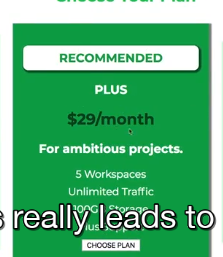

Improving Action Buttons
------------------------

```css
.button{
    background-color: #0e4f1f;
    color: white;
    /*forces the inherited styles to be applied*/
    font: inherit ;
}
```

button has some strange defaults it looks like- inspect it inthe developer tools

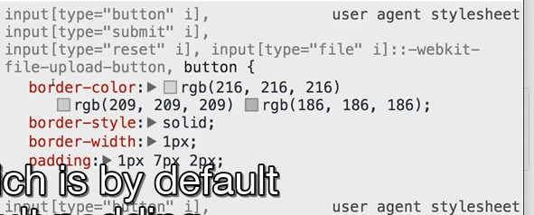

also alot of defaults when it comes to the text of the button- thats why the font here and the text in general doesnt look like text on the rest of page- the browser assigns a font lets assign font inherit

```css
.button{
    background-color: #0e4f1f;
    color: white;
    /*forces the inherited styles to be applied*/
    font: inherit ;
    border: 1.5px solid #0e4f1f;
    padding: 8px;
    border-radius: 8px ;
    font-weight: bold;
    /*you get the hand on hover now*/
    cursor: pointer;
}
```

now looks better but when hover over it you get no indiciation that its a button - you dont get the hand cursos of the hovered style

```css
.button:hover,
.button:active {
    background: white;
    color: #0e4f1f;
}
```

also get a blue outline and lets understand what an outline actially is

Understanding Outlines
----------------------

the blue outline is browsser default- inspect in developer tools and lcikc pseudo selector :hov and select :active and see what the button looks liek if it is active

the focus has this outline property- its comparable to the border but its not part of the box model

```css
.button:hover,
.button:active {
    background: white;
    color: #0e4f1f;
    outline: none;
}
```

Presenting the Core Features to the User
----------------------------------------

attached is some html file to the new section

```html
<section id="key-features">
            <h1 class="section-title">Many Good Reasons to Stick Around</h1>
            <ul class="key-feature__list">
                <li class="key-feature">
                    <div class="key-feature__image">

                    </div>
                    <p class="key-feature__description">3,857,000 Trusting Customers</p>
                </li>
                <li class="key-feature">
                    <div class="key-feature__image">

                    </div>
                    <p class="key-feature__description">99.999% Uptime Guarantee</p>
                </li>
                <li class="key-feature">
                    <div class="key-feature__image">

                    </div>
                    <p class="key-feature__description">Lightning Fast CDN</p>
                </li>
            </ul>
        </section>
```

Styling the Headline of the Core Features Section
-------------------------------------------------

style the list as well

adding an id key-features to the section

```css
#key-features {
    background: #ff1b68;
    margin-top: 80px;
    padding: 16px;
}

#key-features .section-title {
    color: white;
    margin: 32px;
}
```

looks better

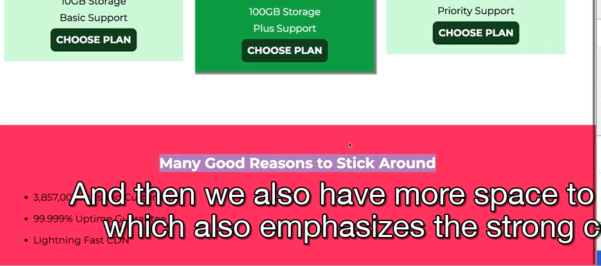

lets work on the bullet points together

```css
.key-feature__list {
    list-style: none;
    margin: 0;
    padding: 0;
    text-align: center;
}

.key-feature {
    display: inline-block;
    width: 33%;
    /*this should ensure all key feature li is aligned to the top*/
    vertical-align: top;
}

  .key-feature__description {
    text-align: center;
    font-weight: bold;
    color: white ;
    font-size: 20px;
}
```

lets prepare the image containers

```css
.key-feature__image {
    background: #ffcede;
    width: 128px;
    border: 2px solid #424242;
    /*to turn edges into rounded corners*/
    border-radius: 50
    /*need ot add height to it*/
    /*height has to match the width*/
    height: 128px;
}
```

now want to center the circle horizontally

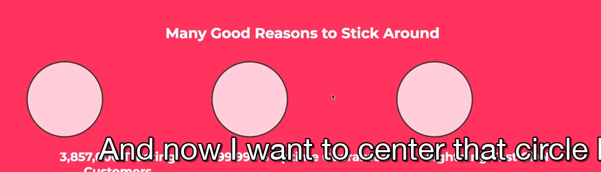

nice trick with the margin property- can set it to left and right but how do you know how much you need to centre this- can set margin auto or margin 0 auto- auto will automatically fill the available space to the left and right equally to center the element horizontally not vertically

```css
.key-feature__image {
    background: #ffcede;
    width: 128px;
    border: 2px solid #424242;
    /*to turn edges into rounded corners*/
    border-radius: 50
    /*need ot add height to it*/
    /*height has to match the width*/
    height: 128px;
    margin: 0 auto;
}
```

Adding the Footer
-----------------

```html
 <footer class="main-footer">
        <nav>
            <ul class="main-footer__links">
                <li class="main-footer__link">
                    <a href="#">Support</a>
                </li>
                <li class="main-footer__link">
                    <a href="#">Terms of Use</a>
                </li>
            </ul>
        </nav>
</footer>
```

```css
.main-footer {
    background-color: black;
    padding: 32px;
}

.main-footer__links {
    list-style: none;
    padding: 0;
    margin: 0;
    text-align: center;
}

.main-footer__link {
    display: inline-block;
    margin: 0 16px;
}

.main-footer__link a {
    color: white;
    text-decoration: none;
}

.main-footer__link a:hover,
.main-footer__link a:active{
    color: #ccc;
}
```

but the anchor tags are styled by the browser default which gives it the underline and blue color

with that the first stage of our site is done

Adding the Packages Page
------------------------

create a new subfolder packaged and inside it name it index.html- want the same header and footer but removed the main content and have to adjust the links in the header

want to split up css into seperate files too because both page suse different styles- there are some shared styles like the header and the footer

make a new css file name it shared.css on same level as main.css copy footer, heaader and navigation code as well as the button related classes

and add the new style link and move it above main.css- but make sure import the shared.css before the main.css file WHY? because we always want to have the chance to overide the shared.css in our own because later styles overide earlier ones same with the packages.css

packages index.html file...

```html
<main>
    <section class="package">
        <a href="#">
            <h1>Our PLUS Plan</h1>
            <h2>The most popular choice of our customers.</h2>
            <p>Benefit from increased storage and faster support to ensure that your mission-critical data and applications
                are always available!</p>
        </a>
    </section>
    <section class="package">
        <a href="#">
            <h1>Our FREE Plan</h1>
            <h2>An extremely solid start into our hosting world.</h2>
            <p>Get started immediately at zero cost!</p>
        </a>
    </section>
    <section class="package">
        <a href="#">
            <h1>Our PREMIUM Plan</h1>
            <h2>All your enterprise needs. Instant support, guaranteed uptime. </h2>
            <p>The best solution for small to large enterprises. Because hosting shouldn't be in the way!</p>
        </a>
    </section>
</main>
```

styling the links...

```css
main {
    padding-top: 32px;
}
```

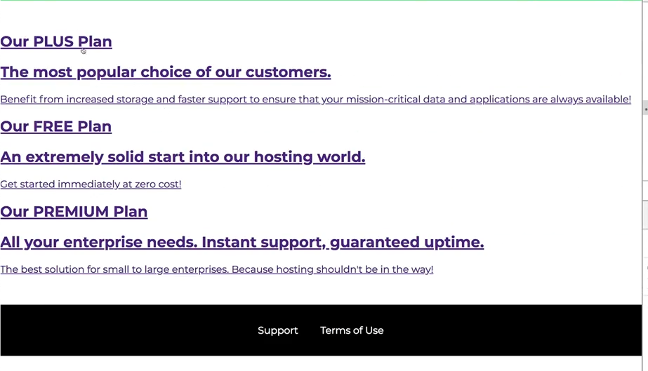

```css
main {
    padding-top: 32px;
}

.package {
    width: 80%;
    margin: 16px 0;
    border: 4px solid #04ef1f;
}
```


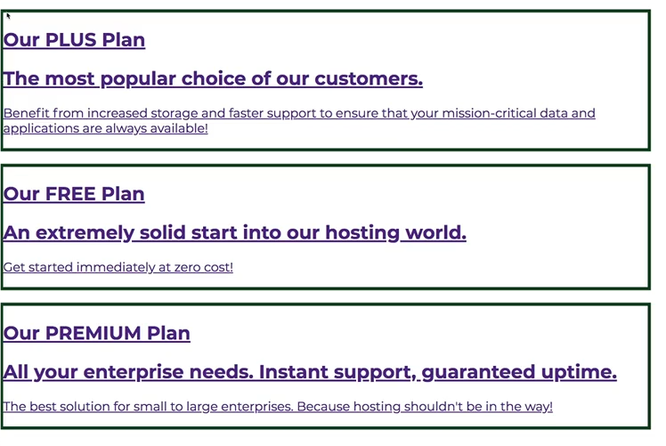

we could get rid of that left border

```css
main {
    padding-top: 32px;
}
.package {
    width: 80%;
    margin: 16px 0;
    border: 4px solid #04ef1f;
    border-left: none;
}

.package a {
    text-decoration: none;
    color: inherit;
    /*have to set it to display block to take the full available space in the surrounding container which is the sectionm*/
    display: block;
    padding: 32px;
}
```

lets style the title subtitle and description

```html
<!DOCTYPE html>
<html lang="en">

<head>
    <meta charset="UTF-8">
    <meta http-equiv="X-UA-Compatible" content="ie=edge">
    <title>uHost</title>
    <link rel="shortcut icon" href="favicon.png">
    <link href="https://fonts.googleapis.com/css?family=Montserrat:400,700" rel="stylesheet">
    <link rel="stylesheet" href="../shared.css">
    <link rel="stylesheet" href="packages.css">
</head>

<body>
    <header class="main-header">
        <div>
            <a href="../index.html" class="main-header__brand">
                uHost
            </a>
        </div>
        <nav class="main-nav">
            <ul class="main-nav__items">
                <li class="main-nav__item">
                    <a href="index.html">Packages</a>
                </li>
                <li class="main-nav__item">
                    <a href="../customers/index.html">Customers</a>
                </li>
                <li class="main-nav__item main-nav__item--cta">
                    <a href="../start-hosting/index.html">Start Hosting</a>
                </li>
            </ul>
        </nav>
    </header>
    <main>
        <section class="package" id="plus">
            <a href="#">
                <h1 class="package__title">Our PLUS Plan</h1>
                <h2 class="package__subtitle">The most popular choice of our customers.</h2>
                <p class="package__info">Benefit from increased storage and faster support to ensure that your mission-critical data and applications
                    are always available!</p>
            </a>
        </section>
        <section class="package" id="free">
            <a href="#">
                <h1 class="package__title">Our FREE Plan</h1>
                <h2 class="package__subtitle">An extremely solid start into our hosting world.</h2>
                <p class="package__info">Get started immediately at zero cost!</p>
            </a>
        </section>
        <section class="package" id="premium">
            <a href="#">
                <h1 class="package__title">Our PREMIUM Plan</h1>
                <h2 class="package__subtitle">All your enterprise needs. Instant support, guaranteed uptime. </h2>
                <p class="package__info">The best solution for small to large enterprises. Because hosting shouldn't be in the way!</p>
            </a>
        </section>
    </main>
    <footer class="main-footer">
        <nav>
            <ul class="main-footer__links">
                <li class="main-footer__link">
                    <a href="#">Support</a>
                </li>
                <li class="main-footer__link">
                    <a href="#">Terms of Use</a>
                </li>
            </ul>
        </nav>
    </footer>
</body>

</html>
```

```css
.package__subtitle {
    color: #979797;
}

.package__info {
    padding: 16px;
    border: 1 px solid green;
    font-size: 20px;
    color: #04ef1f;
}
```

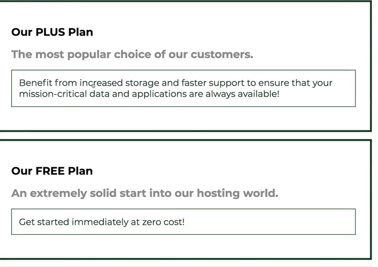

lets style each plan targeitn each unique id

```css
#plus {
    background: rgba(213, 255, 220, 0.95);
}

#free {
    background: rgba(234, 252, 237, 0.95);
}

#premium {
    background: rgba(14, 79, 31, 0.95);
}
```

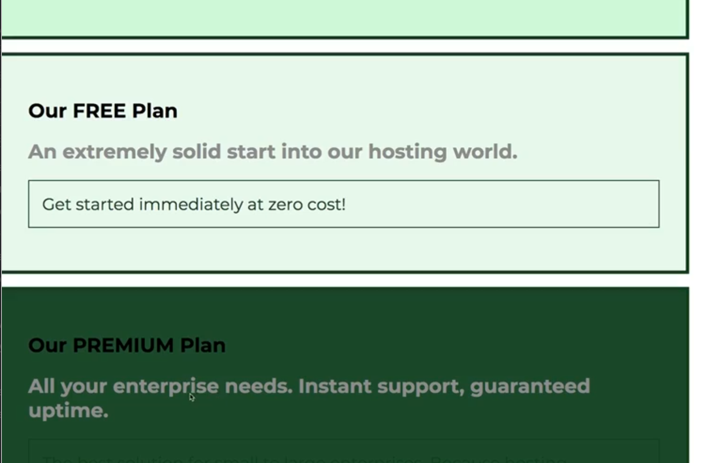

now just going to add background-color to package\_\_info

```css
.package__info {
    background: white;
}

#premium .package__title {
    color: white;
}

#premium .package__subtitle {
    color: #bbb;
}
```

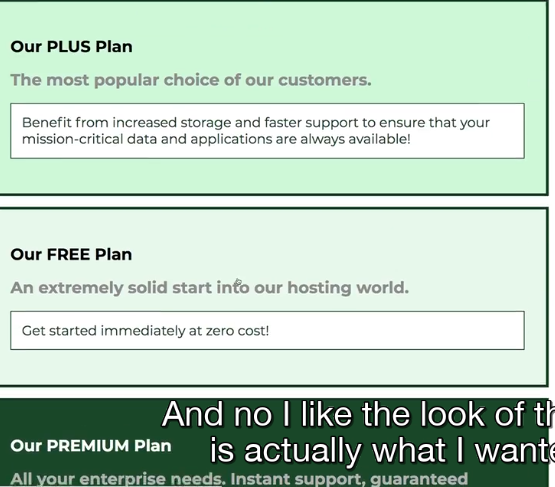

```css
.package:hover,
.package:active {
    box-shadow: 2px 2px 4px rgba(0,0,0,0.5); 
    border-color: #ff5454;
}
```

looking good now

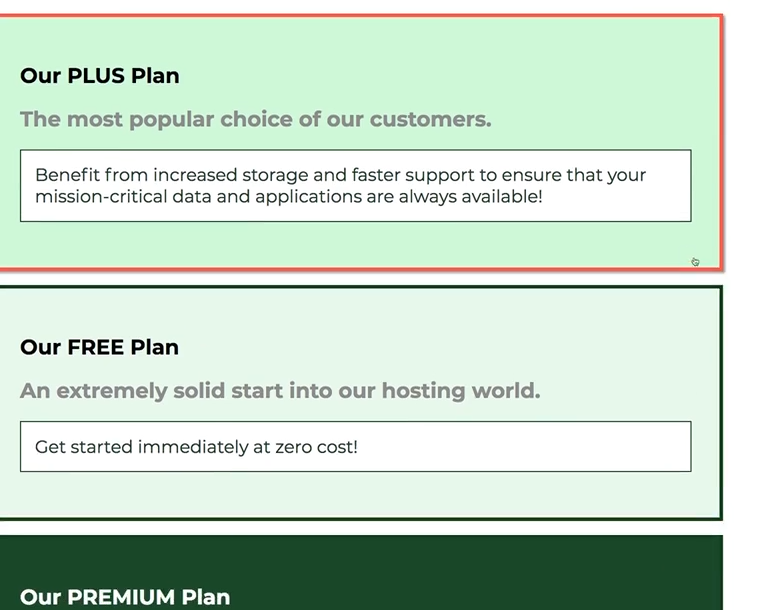

Adding Float to Our Package
---------------------------

so the middle plan should be position on the right of our page- how can we do this? how can we achieve this?

floats do not use that often anymore bc they can cause problems - now use flexbox

float means you overridedeffauly psootioning and tell browser to push element to left or right of the page

float also takes element out of the document flow- which is why we are not using floats that often because you rarely want this

```css
#free {
    background: rgba(234, 252, 237, 0.95);
    float: right;
}
```

you see its moved to the right and the bottom element takes its place

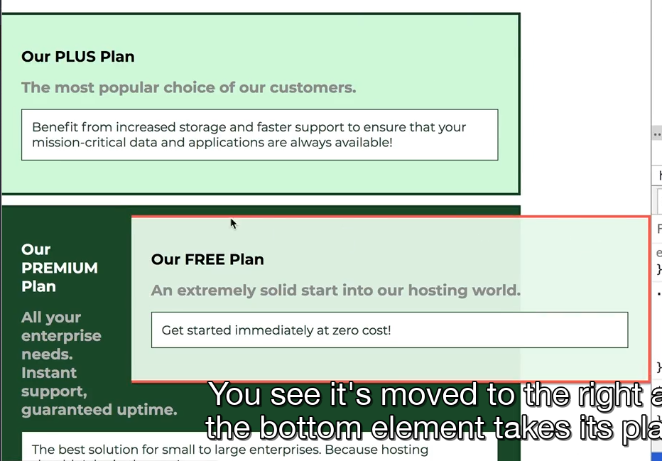

what we have to do is keep its space reserved and tell the other block level elemenets that come after it that they shouldnt respect any previous floatings- we do this with a little hack

We do this with a little hack by adding an addition div after the element you floated

```html
<div class="clear"></div>
```

```css
.clear {
    clear: both;
}
```

this means any elements coming after this element will not respect previous floats

this is a hacky way of doing that - can now use flexbox which makes it cleaner

now just need to fix the border right and set text-align to right and also fix the hover now

```css
#free:hover {
    border-left-color: #ff5454;
}
```

or could use !important which is bad practice and breaks concept of specifity - better to use in some case like third party library

Adding the FInal Touches
------------------------

we could center the plans because they are not centered right now

give the wrapping div that contains the three plans a class called “plan\_\_list"

in main.css

```css
.plan__list {
    width: 80%;
    margin: 0 auto;
}
```

we have three inline blocks sitting next to each other

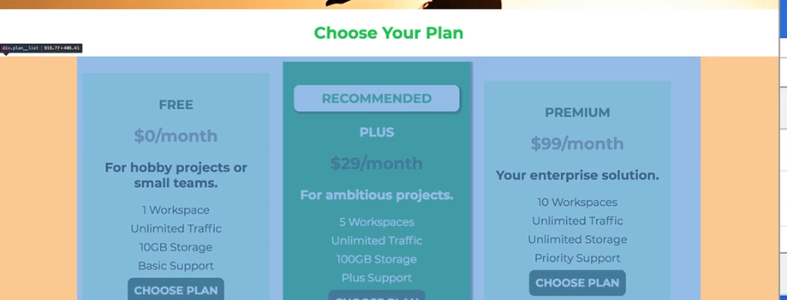

the wrapping div is centered on the page but inside these three elements are not

can do that by adding

```css
text-align: center
```

```css
.plan__list {
    width: 80%;
    margin: 0 auto;
    text-align: center;
}
```

now see the three elements are centered within their div

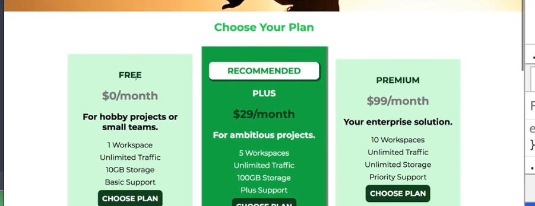

