allows us to change position of elements on our website

Why Positioning Will Improve Our Website
----------------------------------------

could change posotion of nav bar to make it sticky and sticky

on packages page dont have background image and plus plan and add a badge to it so our users see this is the recommended plan

Understanding Posotiion: The Theory
-----------------------------------

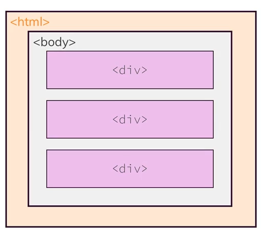

these elemeents are following the document flow- is there already some property applied already to make sure this document flow is followed? yes the posotiion is applied by default with a value of static

```css
position: static
```

but what if want to place div somewhere else liek the upper right

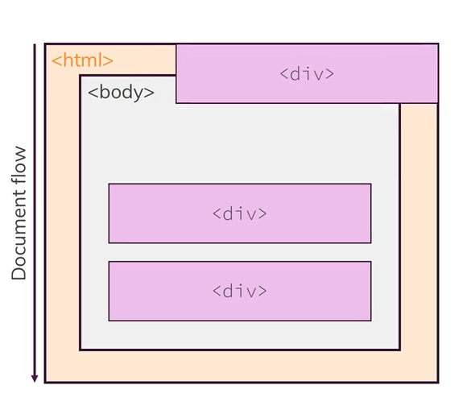

have to specify either absolute, relative or fixed- sticky is a new value for this property

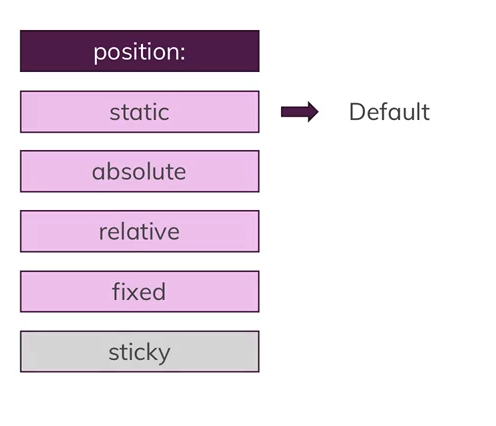

Change the position:

once we set position to a value other than static we have 4 different options:

1. top
2. bottom
3. left
4. Right

with these properties you change your element from its original position in the document flow

top could mean move top or position from the top of the viewport, html or body

Working with the Fixed Value
----------------------------

```html
<!DOCTYPE html>
<html lang="en">
    <head>
        <meta charset="UTF-8">
        <meta http-equiv="X-UA-Compatible" content="ie=edge">
        <link rel="stylesheet" href="main.css">
        <title>Position</title>
    </head>
    <body>
        <div class="parent">
            <div class="child-1">Navigation Bar</div>
            <div class="child-2">Background Image</div>
            <div class="child-3">Features</div>
        </div>
    </body>
</html>
```

```css
html {
    background: #b3b3b3;
    padding: 15px;
    border: 5px solid white;
    margin: 15px;
    height: 2000px;
}

body {
    background: #fa923f;
    padding: 20px;
    border: 5px solid black;
    margin: 0;
  }
  
.parent {
    background: white;
    padding: 20px;
    border: 5px solid black;
    margin: 0;
  }
  
.parent div {
    background: rgb(105, 105, 109);
    color: white;
    padding: 10px;
    border: 5px solid black;
    margin: 10px;
}
```


```css
.parent .child-1 {
    top: 100px;
}
```

nothing happens- all the positioning changes can only happen if we use a posotiin other than static

```css
.parent .child-1 {
    position: fixed;
}
```

we can see that the posootion already canged

1- the width decreased significantly

2- the element now is basically not existing now for the other elements- it is taken out of the document flow- means for all the other elements this nav element is non existing


did we create an inline element here?? if try change the width on an inlien element it should have no effect

but in this case you can set the width- it behaves like an inline block element

```css
.parent .child-1 {
    position: fixed;
    width: 400px;
    top: 100px;
}
```

the element moved down a bit

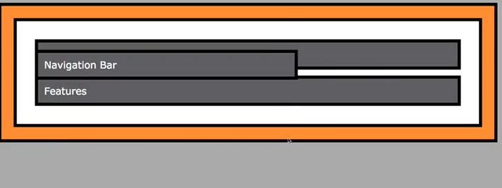

but top from where? if set it to 0 should see

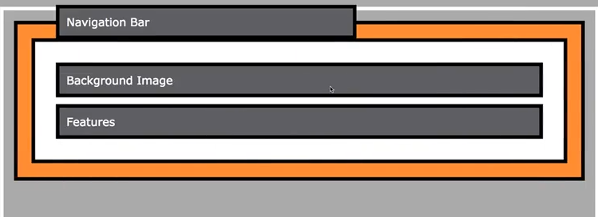

remove the margin as well and it becomes evident

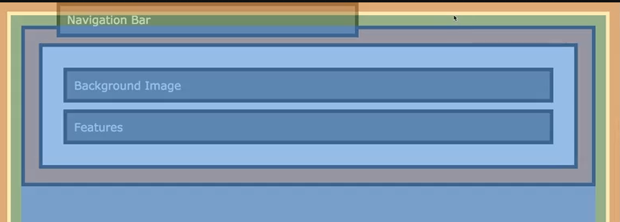

nav bar is not dependend on the html element but basically has the viewport as the positiioning context

```css
.parent .child-1 {
    position: fixed;
    width: 400px;
    top: 0;
    margin: 0;
    width: 100%;
}
```

but problem is border is kind of located outside of our viewport

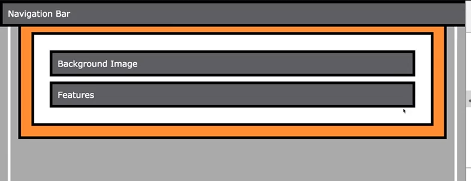

```css
.parent .child-1 {
    position: fixed;
    width: 400px;
    top: 0;
    margin: 0;
    width: 100%;
    /*add box sizing border box*/
    box-sizing: border-box;
}
```

Lets Add it to Our Website
--------------------------

```html
 <header class="main-header">
        <div>
            <a href="index.html" class="main-header__brand">
                uHost
            </a>
        </div>
        <nav class="main-nav">
            <ul class="main-nav__items">
                <li class="main-nav__item">
                    <a href="packages/index.html">Packages</a>
                </li>
                <li class="main-nav__item">
                    <a href="customers/index.html">Customers</a>
                </li>
                <li class="main-nav__item main-nav__item--cta">
                    <a href="start-hosting/index.html">Start Hosting</a>
                </li>
            </ul>
        </nav>
    </header>
```

```css
.main-header {
    width: 100%;
    position: fixed;
    padding: 8px 16px;
    background: #2ddf5c;
}
```

generally seems to work fine- why not add top: 0 ? as soon as you add a margin to a html element or the body element or any parent eleement of ehader then have to add top: 0 and left :0 in case want to stick to left top of the page

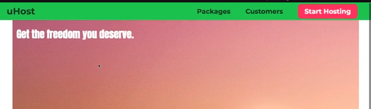

Using Position to add a Background Image to the Packages Page
-------------------------------------------------------------

going to add a new div with class background

```html
<header class="background">
    <div>
        <a href="index.html" class="main-header__brand">
            uHost
        </a>
    </div>
    <div class="background"></div>
    <nav class="main-nav">
        <ul class="main-nav__items">
            <li class="main-nav__item">
                <a href="packages/index.html">Packages</a>
            </li>
            <li class="main-nav__item">
                <a href="customers/index.html">Customers</a>
            </li>
            <li class="main-nav__item main-nav__item--cta">
                <a href="start-hosting/index.html">Start Hosting</a>
            </li>
        </ul>
    </nav>
</header>
```

create new images folder and add plans-background.jpg

```css
.background {
    background: url("../imagesplans-background.jpg");
}
```

not alot changed

```css
.background {
    background: url("../imagesplans-background.jpg");
    width: 100%;
    height: 100%;
}
```

this also doesnt work

this one below works

```css
.background {
    background: url("../imagesplans-background.jpg");
    width: 500px;
    height: 500px;
}
```

want the image behind the content of the page

```css
.background {
    background: url("../imagesplans-background.jpg");
    width: 500px;
    height: 500px;
    position: fixed;
}
```

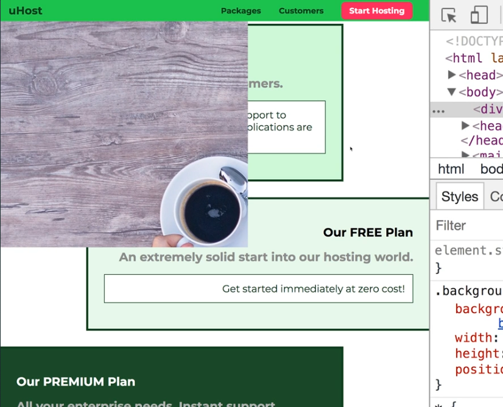

can change the height and width back to 100% now

```css
.background {
    background: url("../imagesplans-background.jpg");
    width: 100%;
    height: 100%;
    position: fixed;
}
```


Understanding the Z-Index
-------------------------

we also need to posiiton elements to position against the z-index- can do that in css

z-index by default is auto. the auto value is equal to zero

adding a z-index to elemenets not in position: static z-index has no effect

```css
.background {
    background: url("../imagesplans-background.jpg");
    width: 100%;
    height: 100%;
    position: fixed;
    z-index: -1;
}
```


if two elements position:fixed and no-z index set then the order in html will matter- the html element that comes last will appear above the first element

Adding a Badge to Our Package
-----------------------------

```html
 <main>
        <section class="package" id="plus">
            <a href="#">
                <h1 class="package__title">Our PLUS Plan</h1>
                <h1 class="package__badge">RECOMMENDED</h1>
                <h2 class="package__subtitle">The most popular choice of our customers.</h2>
                <p class="package__info">Benefit from increased storage and faster support to ensure that your mission-critical data and applications
                    are always available!</p>
            </a>
        </section>
        <section class="package" id="free">
            <a href="#">
                <h1 class="package__title">Our FREE Plan</h1>
                <h2 class="package__subtitle">An extremely solid start into our hosting world.</h2>
                <p class="package__info">Get started immediately at zero cost!</p>
            </a>
        </section>
        <section class="package" id="premium">
            <a href="#">
                <h1 class="package__title">Our PREMIUM Plan</h1>
                <h2 class="package__subtitle">All your enterprise needs. Instant support, guaranteed uptime. </h2>
                <p class="package__info">The best solution for small to large enterprises. Because hosting shouldn't be in the way!</p>
            </a>
        </section>
    </main>
```

```css
.package__badge {
    position: fixed;
}
```

now taken out of the document flow


```css
.package__badge {
    position: fixed;
    top: 0;
    left: 0;
}
```

now position left to viewport

```css
.package__badge {
    position: fixed;
    top: 50px;
    left: 400px;
    margin: 20px;
}
```

but htis is now alot of trial and error and positon: fixed is related to the viewport

not the behaviour we want to have- need another value

we can change position fixed to absolute

```css
.package__badge {
    position: absolute;
    top: 50px;
    left: 400px;
    margin: 20px;
}
```

this position abolsute also takes the element out of the document flow

the positioning context is now based on two cases- if none of the parents have posiiton applied then the positioning context is simply the html element

if we have any posiiton ancestors then the closes element with position applied is the positioning context for this element

```css
.package__badge {
    position: absolute;
    top: 0;
    left: 400px;
    margin: 20px;
}
```

see that it is stuck to the html element

can applied relative to parent element

```css
.package {
    position: relative;
}

.package__badge {
    position: absolute;
    top: 0;
    left: 400px;
    margin: 20px;
}
```

the relative value doesnt take out elements out of the document flow - the posiitoning context now changed to the closest ancestor with a position property applied

fixed and absolute are similar but for fixed the position context is always the viewport. with absolute it depends. if no parent element has position the positioning context is the html. if parent has position applied then positioning context will be set to the parent element

```css
.package {
    position: relative;
}

.package__badge {
    position: absolute;
    top: 0;
    right: 0;
    margin: 20px;
    font-size: 12px;
    color: white;
    background: #ff5454;
    padding: 8px;
}
```


Diving Depper Into Relative Positioning
---------------------------------------

```html
<!DOCTYPE html>
<html lang="en">
    <head>
        <meta charset="UTF-8">
        <meta http-equiv="X-UA-Compatible" content="ie=edge">
        <link rel="stylesheet" href="main.css">
        <title>Position</title>
    </head>
    <body>
        <div class="parent">
            <div class="child-1">Navigation Bar</div>
            <div class="child-2">Background Image</div>
            <div class="child-3">Features</div>
        </div>
    </body>
</html>
```

```css
html {
    background: #b3b3b3;
    padding: 15px;
    border: 5px solid white;
    margin: 15px;
    height: 2000px;
}

body {
    background: #fa923f;
    padding: 20px;
    border: 5px solid black;
    margin: 0;
  }
  
.parent {
    background: white;
    padding: 20px;
    border: 5px solid black;
    margin: 0;
  }
  
.parent div {
    background: rgb(105, 105, 109);
    color: white;
    padding: 10px;
    border: 5px solid black;
    margin: 10px;
}
```


```css
.parent .child-1 {
    position: relative;
}
```

the element stays and behaves the same way- we can change the posiitoning context of other elements

```css
.parent .child-1 {
    position: relative;
    top: 50px;
    left: 50px;
}
```

for relative positioning the element is not taken out of the document flow - the positioning contet is the elmenet itself- we are moving it according to its initial position

can even make it leave its parent

Working with Overflow and Relative Positioning
----------------------------------------------

to avoid moving element out of parent

```css
.parent {
    overflow: hidden;
}
```

will hide the element once it is outside the parent

if apply overflow: hidden to body will simply be passed onto the html element - so not on body element really

cant change htis behaviour- can add it to both html and body element and it will work

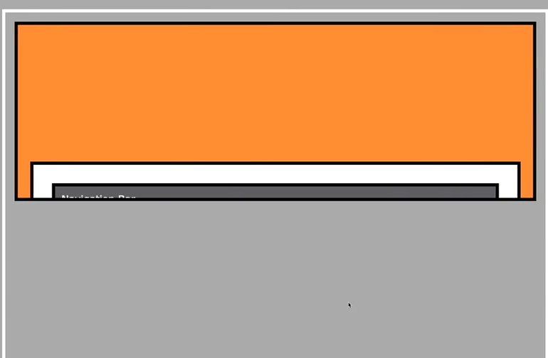

Introducing Sticky Positioning 
-------------------------------

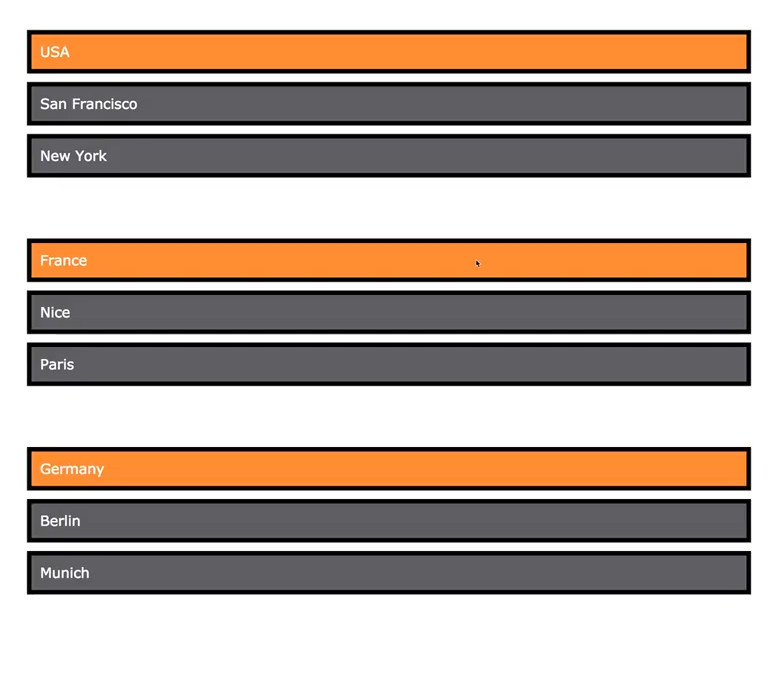

sticky is a combo of relative and fixed- as soon as add top property behaves like a fixed element once we reach a certain border

the border is reached depending on our posiiton of the viewport

Understanding the Stacking Context
----------------------------------

we set all parent elements with posiiton fixed- each element has its own stacking context

for the elements inside the parent elemenent the z-index will only have an impact inside the parent element but not outside

