Understanding Background Size
-----------------------------

```css
#product-overview {
    /*background: url("freedom.jpg");*/
    background-image: url("freedom.jpg");
    /*takes couple of different values*/
    background-size: 100px;
    width: 100%;
    height: 528px;
    padding: 10px;
    margin-top: 43px;
}
```

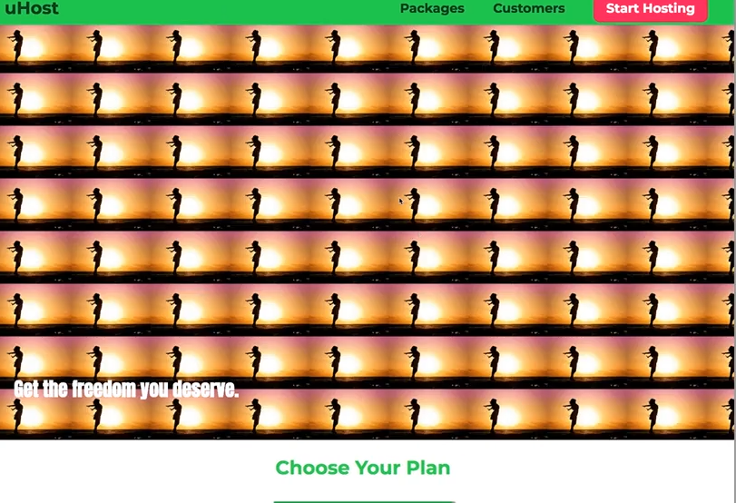

see many small images- each image has width of 100px this refers to the width . can set background-repeat to no repeat to not repeat the image and only get one

or can set it to repeat-x to only repeat it on the x axis so you only get one row and can also repeat-y

can also set a second value for the background-size

```css
#product-overview {
    /*background: url("freedom.jpg");*/
    background-image: url("freedom.jpg");
    /*takes couple of different values*/
    background-size: 300px 100px;
    width: 100%;
    height: 528px;
    padding: 10px;
    margin-top: 43px;
}
```

the second value sets the height of the image- if dont set it the height is auto adjusted to keep the aspect ratio- but if set it it might be distorted

beside pixels can also set percentage width

```css
#product-overview {
    /*background: url("freedom.jpg");*/
    background-image: url("freedom.jpg");
    /*takes couple of different values*/
    /*now takes 50% of container width*/
    background-size: 50%
    width: 100%;
    height: 528px;
    padding: 10px;
    margin-top: 43px;
}
```

could also set width automatically and the height to be 100%- this will keep aspect ratio

```css
background-image: auto 100%;
```

rarely have a perfect fit of container and image

image might get cropped- we can control how it gets cropped

besides manually setting width and height get some predefined keywords

```css
background-size: cover;
```

cover finds out which part of container is the important one - our image has ascpect ratio where it is wider than it is height - cover automatically finds out that it should set the width to 100% because the height will then have some excess space

```css
background-size: contain;
```

the whole images gets contained image doesnt fill entire container it ensures the entire image is container

Understanding Background Position 
----------------------------------

couple of ways of using it

simplest way is set pixel value

```css
#product-overview {
    background-image: url("freedom.jpg");
    background-size: cover;
    background-repeat: no-repeat;
    background-position: 20px;
    width: 100%;
    height: 528px;
    padding: 10px;
    margin-top: 43px;
}
```

image gets moved to the right by 20px


the first value defines the x axis defines how the left edge of the image should be poisitoned releative to the left edge of the container

```css
#product-overview {
    background-image: url("freedom.jpg");
    background-size: cover;
    background-repeat: no-repeat;
    background-position: 20px 50px;
    width: 100%;
    height: 528px;
    padding: 10px;
    margin-top: 43px;
}
```


can also use % values

```css
#product-overview {
    background-image: url("freedom.jpg");
    background-size: cover;
    background-repeat: no-repeat;
    background-position: 10%;
    width: 100%;
    height: 528px;
    padding: 10px;
    margin-top: 43px;
}
```

the first value is the x axis the second value is the y-axis

can also set center

```css
    background-position: center; same as 50 50
    background-position: left top; same as 0 0 
    background-position: left bottom; same as 0 100 
    
    
    /*can aslo do this*/
    background-position: left 10% bottom 20%;

```

The Background Shorthand
------------------------

background is a shorthand property

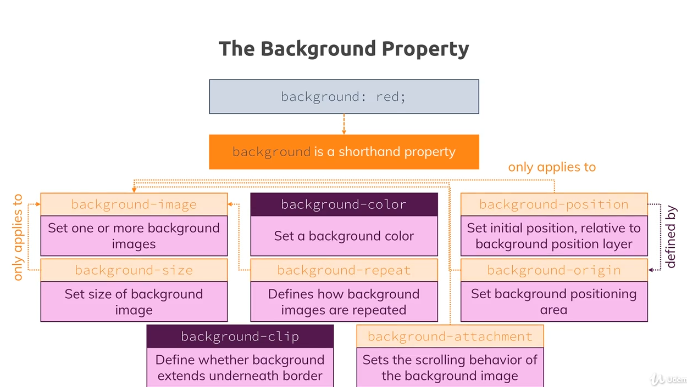

Applying Background Origin Clip Attachment 
-------------------------------------------

lets start background-origin this is simialr to box-sizing

```css
#product-overview {
    background-image: url("freedom.jpg");
    background-size: cover;
    background-repeat: no-repeat;
    background-position: left 10% bottom 20%%;
    width: 100%;
    height: 528px;
    padding: 10px;
    margin-top: 43px;
    border: 5px dashed red;
}
```


on the left and right there is whitespace - bc the left and right part of the image fit inside the container but the border doesnt seem to be part of the container width

the top and bottom the broder also isnt part of the container but we have excess space on our image so we crop it and that happens after the border

we can control this with background-origin and set it to border-box

```css
#product-overview {
    background-image: url("freedom.jpg");
    background-size: cover;
    background-repeat: no-repeat;
    background-position: left 10% bottom 20%%;
    background-origin: border-box;
    width: 100%;
    height: 528px;
    padding: 10px;
    margin-top: 43px;
    border: 5px dashed red;
}
```

here we define what out container is for our background image by default it is not the broder box

```css
    /*this means the background image starts from the upper left corner of the padding edge*/
    /*this is the default */
    background-origin: padding-box;
    
    /*The background image starts from the upper left corner of the border*/
    background-origin: border-box;
    
    /*The background image starts from the upper left corner of the content*/
    content-box
```

if set to border-box will ensure the image goes beneath the border even though we will remove it later

Background-clip 
----------------

define where the image should be clipped if necessary

by setting it to

```css
background-clip: padding-box;
```

now its clipped after the padding

going to set both origin and clip to border-box


Background-Attachment 
----------------------

sets whether a background-image scrolls with the rest of the page, or is fixed- default is scroll

Applying Shorthand Properties
-----------------------------

```css
#product-overview {
    background-image: url("freedom.jpg");
    background-size: cover;
    background-repeat: no-repeat;
    background-position: left 10% bottom 20%%;
    background-origin: border-box;
    background-clip: border-box;
    width: 100%;
    height: 528px;
    padding: 10px;
    margin-top: 43px;
    border: 5px dashed red;
    position: relative;
}
```

Styling Images
--------------

```html
<header class="main-header">
<div>
    <a href="index.html" class="main-header__brand">
        
    </a>
</div>
```


```css
.main-header__brand {
    color: #0e4f1f;
    text-decoration: none;
    font-weight: bold;
    font-size: 22px;
    
    /*lets add height to keep it in line qwith our font size*/
    height: 22px;
}
```

but when reload it doesn’t have any effect- by setting a height of a container the image will not be affected bc the default behaviour is if you enter an img tag then the default height and width will be entered into document no matetr which width and height set for surrounding element

to make the img can do two routes

```css
.main-header__brand img {
    height: 22px;
}
```

now it is working


can also change it to 100% to take the height of the container

```css
.main-header__brand img {
    height: 100%;
}
```

BUT this wont work either- it will lead the img to take its original height again not the height of the container

% values on img also dont work for width this is because the surrounding container is an inline element its just an anchor tag

if set the container to inline-block instead now the img respects the containers style

thats all we can really do with styling img elements- if want to do more ocmplex styling use background-img- downside is its not part of the document flow and is not good for accessibility

Adding the Customers Page to Our Website
----------------------------------------

create new folder /customers

```html
<!DOCTYPE html>
<html lang="en">

<head>
    <meta charset="UTF-8">
    <meta name="viewport" content="width=device-width, initial-scale=1.0">
    <meta http-equiv="X-UA-Compatible" content="ie=edge">
    <title>uHost Customers</title>
    <link rel="shortcut icon" href="../favicon.png">
    <link href="https://fonts.googleapis.com/css?family=Anton|Montserrat:400,700" rel="stylesheet">
    <link rel="stylesheet" href="../shared.css">
    <link rel="stylesheet" href="customers.css">
</head>

<body>
    <header class="main-header">
        <div>
            <a href="../index.html" class="main-header__brand">
                
            </a>
        </div>
        <nav class="main-nav">
            <ul class="main-nav__items">
                <li class="main-nav__item">
                    <a href="../packages/index.html">Packages</a>
                </li>
                <li class="main-nav__item">
                    <a href="index.html">Customers</a>
                </li>
                <li class="main-nav__item main-nav__item--cta">
                    <a href="start-hosting/index.html">Start Hosting</a>
                </li>
            </ul>
        </nav>
    </header>
    <main>
        <div>
            <div class="testimonial" id="customer-1">
                <div class="testimonial__image-container">
                    
                </div>
                <div class="testimonial__info">
                    <h1 class="testimonial__name">Mike Statham</h1>
                    <h2 class="testimonial__subtitle">Founder of
                        <a href="tech-analysis.com">tech-analysis.com</a>
                    </h2>
                    <p class="testimonial__text">uHost helped me realize my project with a highly constrained budget in like no time.</p>
                </div>
            </div>
            <div class="testimonial" id="customer-2">

                <div class="testimonial__info">
                    <h1 class="testimonial__name">John Mellow</h1>
                    <h2 class="testimonial__subtitle">Hosts his private videos on uHost.
                    </h2>
                    <p class="testimonial__text">I worked as a blogger and always looked for an integrated hosting and file storage solution. I found
                        it in uHost!
                    </p>
                </div>
                <div class="testimonial__image-container">
                    
                </div>
            </div>
        </div>
    </main>
    <footer class="main-footer">
        <nav>
            <ul>
                <li>
                    <a href="#">Support</a>
                </li>
                <li>
                    <a href="#">Terms of Use</a>
                </li>
            </ul>
        </nav>
    </footer>
</body>

</html>
```

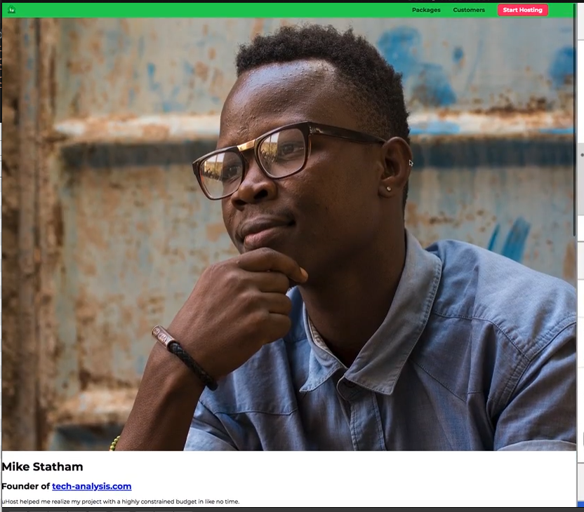

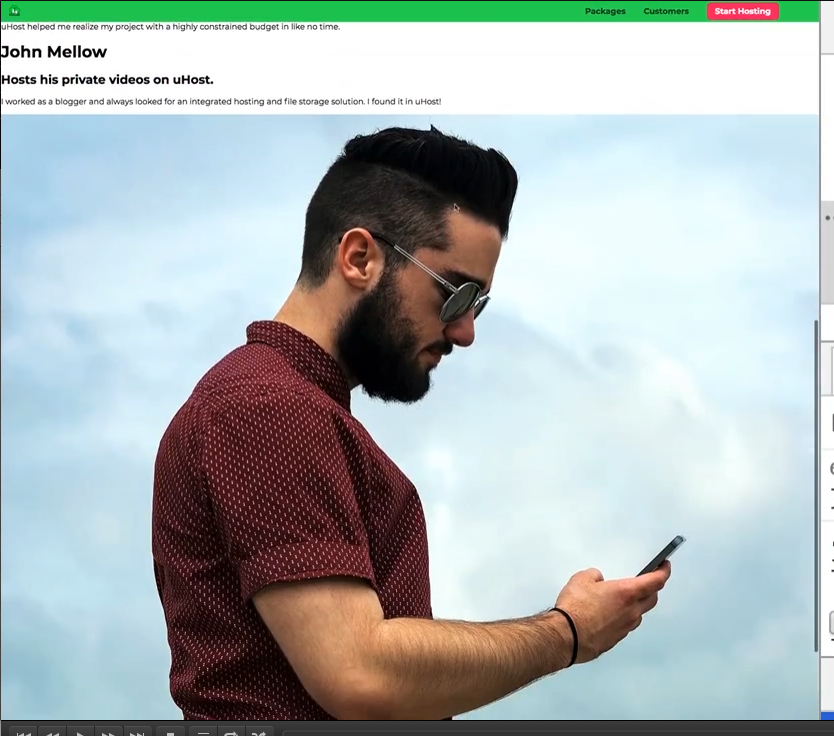

images really big

Working on the Image Layout
---------------------------

attached is some pre-defined css code that styles everything but the images- just setting some margins, paddings, some inline block display styles

```css
.testimonial {
    font-size: 20px;
    margin: 48px 0;
  }
  
  .testimonial__list {
    width: 80%;
    margin: auto;
  }
  
  .testimonial:first-of-type {
    margin-top: 96px;
  }
  
  .testimonial__info {
    text-align: right;
    padding: 14px;
    display: inline-block;
    vertical-align: middle;
  }
  
  #customer-2.testimonial {
    text-align: right;
  }
  
  #customer-2 .testimonial__info {
    text-align: left;
  }
  
  .testimonial__name {
    margin: 3px;
    color: #ff5454;
  }
  
  .testimonial__subtitle {
    margin: 0;
    font-size: 18px;
    color: #ccc;
  }
  
  .testimonial__subtitle a {
    color: inherit;
    text-decoration: none;
  }
  
  .testimonial__subtitle a:hover,
  .testimonial__subtitle a:active {
    color: #7a7a7a;
  }
  
  .testimonial__text {
    margin: 3px;
  }
  
  
```


lets start working on the img container

```css
.testimonial:first-of-type {
    margin-top: 96px;
}

.testimonial__image-container {
   /*dont want there to be a line break so making it inline block*/
   display: inline-block;
    width: 80%;
}

.testimonial__image {
    width: 100%;
}
```

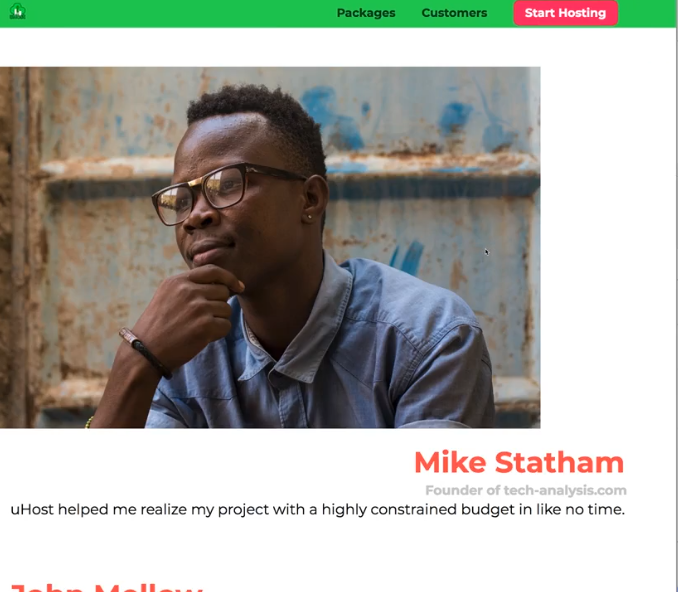

still they dont fit into one line with our other text- we have to go to testimonial info and limit its width

```css
.testimonial:first-of-type {
    margin-top: 96px;
}

.testimonial__image-container {
   display: inline-block;
   /*change it to 70%*/
    width: 70%;
}

.testimonial__image {
    width: 100%;
}
```

```css
  .testimonial__info {
    text-align: right;
    padding: 14px;
    display: inline-block;
    vertical-align: middle;
    width: 20%;
  }
```

now the text is next to the image

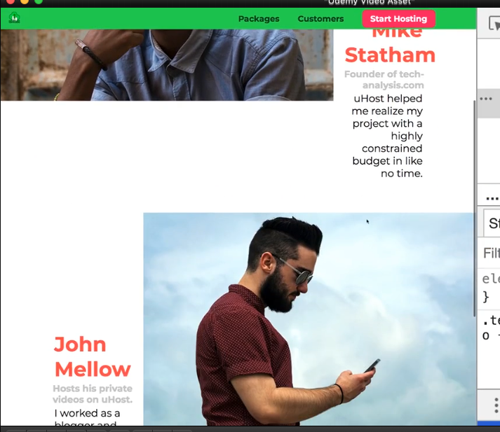

its not aligned in the middle tho

our info-cintainer has vertical-align: mdidle but the image container doesn yet

```css
.testimonial__image-container {
    display: inline-block;
    width: 70%;
    vertical-align: middle;
}
```

now the tetx is poisitoned in the middle

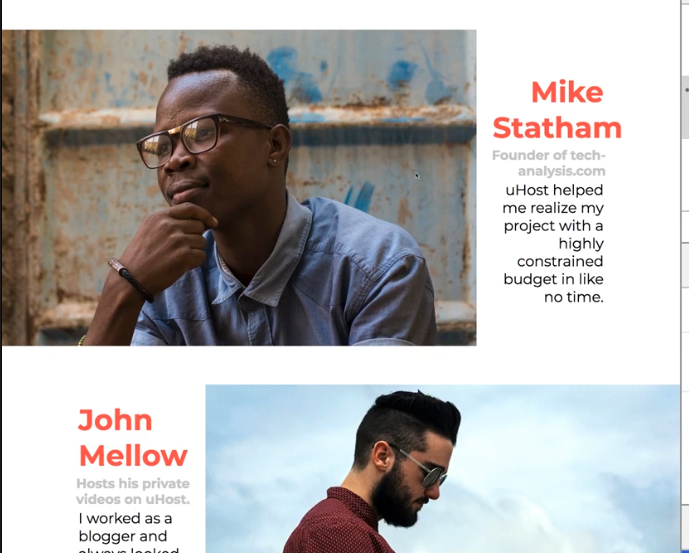

can play around with the sizes now

lets add shadow behind these images

```css
.testimonial__image-container {
   display: inline-block;
    width: 70%;
    vertical-align: middle;
    box-shadow: 3px 3px 3px rgba(0,0,0,0.3);
}
```

gets the nice shadow

but do get annoying white space at bototm of the image- this is an inline element bug. can fix that by going to testimonial-image and setting vertical-align to middle


```css
.testimonial-image {
    vertical-align: top;
    width: 100%;
}
```

that gets rid of the whitespace

why does this happen tho?

by default an image is rendered inline like a letter a b or c

there is space below that line for descendors you find on letters like j, or p

You can adjust the vertical-align of the image to position it elsewhere (e.g. the middle) or change the display so it isn't inline.

backgorund images give more felxibility but should only be used for background images

Understanding Linear Gradients
------------------------------

goign to look at thebackground image we have on the starting page - we want to add a linear gradient instead of the image

Gradients, both linear and radial are treated as images- so if were to use sub properties you would target background-image

```css
.product-overview {
    background-image: linear-gradient(red, blue);
}
```

funciton cosnst two parts- first part is the direction of the gradient, can omit it, then first argument would be the color

default is vertically

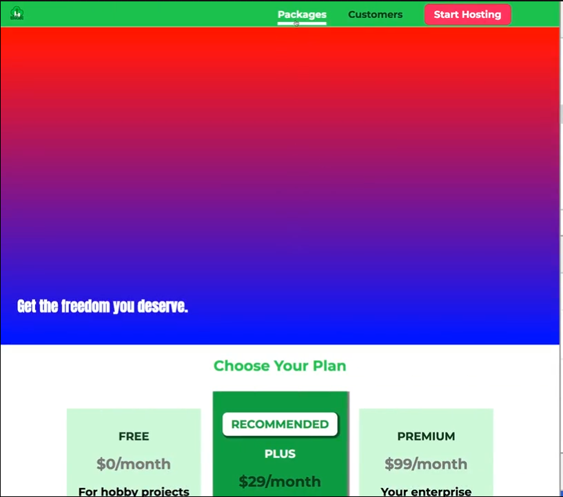

can specify direction

```css
.product-overview {
    background-image: linear-gradient(to bottom, blue);
    width: 100%;
    height: 528px;
    padding: 10px;
    margin-top: 43px;
    position: relative;
}
```

this will result in the same as above

can also do this...

```css
.product-overview {
    background-image: linear-gradient(to left bottom, blue);
    width: 100%;
    height: 528px;
    padding: 10px;
    margin-top: 43px;
    position: relative;
}
```

can also dfine angle with degrees, and define multipel colours

```css
.product-overview {
    background-image: linear-gradient(0deg, red, blue, green, yellow);
    width: 100%;
    height: 528px;
    padding: 10px;
    margin-top: 43px;
    position: relative;
}
```

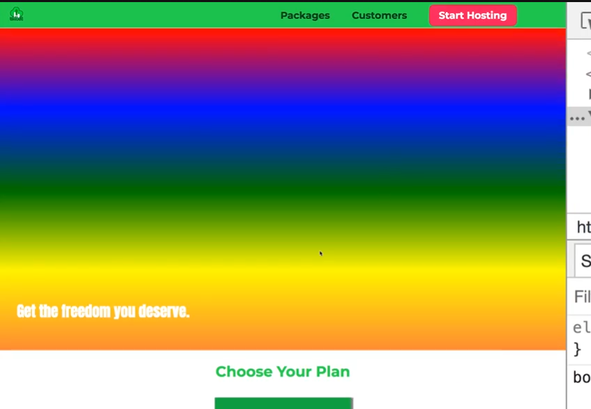

can also implement transparency

```css
.product-overview {
    background-image: linear-gradient(0deg, red, transparent);
    width: 100%;
    height: 528px;
    padding: 10px;
    margin-top: 43px;
    position: relative;
}
```

can also define how much %

```css
.product-overview {
    background-image: linear-gradient(180deg, red 70%, blue, transparent);
    width: 100%;
    height: 528px;
    padding: 10px;
    margin-top: 43px;
    position: relative;
}
```

Radial Gradients
----------------

```css
.product-overview {
    background-image: radial-gradient (red, blue);
    width: 100%;
    height: 528px;
    padding: 10px;
    margin-top: 43px;
    position: relative;
}
```

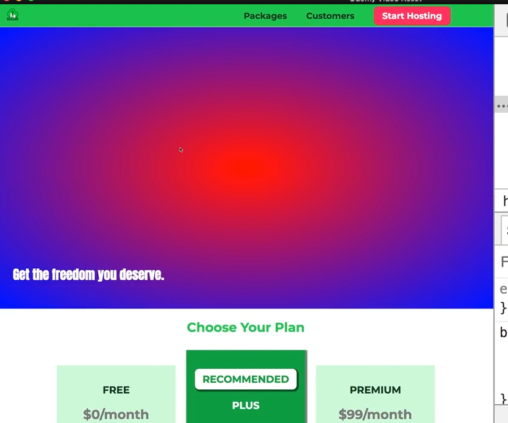

its an elipse but can set circle

```css
.product-overview {
    background-image: radial-gradient (circle, red, blue);
    width: 100%;
    height: 528px;
    padding: 10px;
    margin-top: 43px;
    position: relative;
}
```

can change posiiton where starts- now will be in the top

```css
.product-overview {
    /*background-image: radial-gradient (circle at 20% 50%, red, blue);*/
    background-image: radial-gradient (circle at top, red, blue);
    width: 100%;
    height: 528px;
    padding: 10px;
    margin-top: 43px;
    position: relative;
}

/*can even say top left*/
```

can also set the size

```css
.product-overview {
    background-image: radial-gradient (circle 20px at 20% 50, red, blue, green);
    width: 100%;
    height: 528px;
    padding: 10px;
    margin-top: 43px;
    position: relative;
}
```

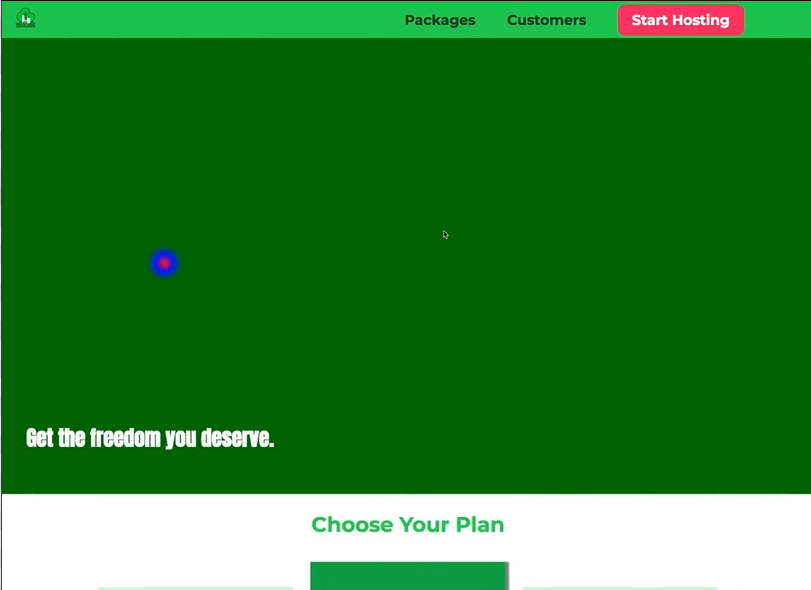

can also add special keywords like farthest-side or closest-side or farthest-corner

Stacking Multiple Backgrounds
-----------------------------

can set multiple backgrounds - but only one solid color can be used - but can use many backgorund images-and remember gradients count as images

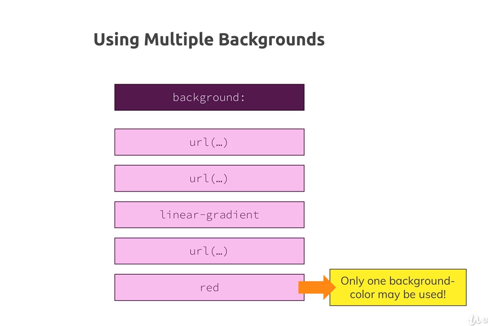

```css
#product-overview {
    background: url("images/freedom.jpg") left 10% bottom 20%/cover no-repeat border-box;
    width: 100%;
    height: 528px;
    margin-top: 43px;
    position: relative;
}
```

going to use red as background color and linear gradient

```css
/*linear gradient will be stacked on top of image because we write it prior to the image*/
#product-overview {
    background: linear-gradient(to top, rgba(80, 68, 18, 0.6) 10%, transpatent), url("images/freedom.jpg") left 10% bottom 20%/cover no-repeat border-box, #ff1b68;
    width: 100%;
    height: 528px;
    margin-top: 43px;
    position: relative;
}
```


Understanding Filters
---------------------

filters allow us to change the visual appearance of an eleemnt by applying a filter

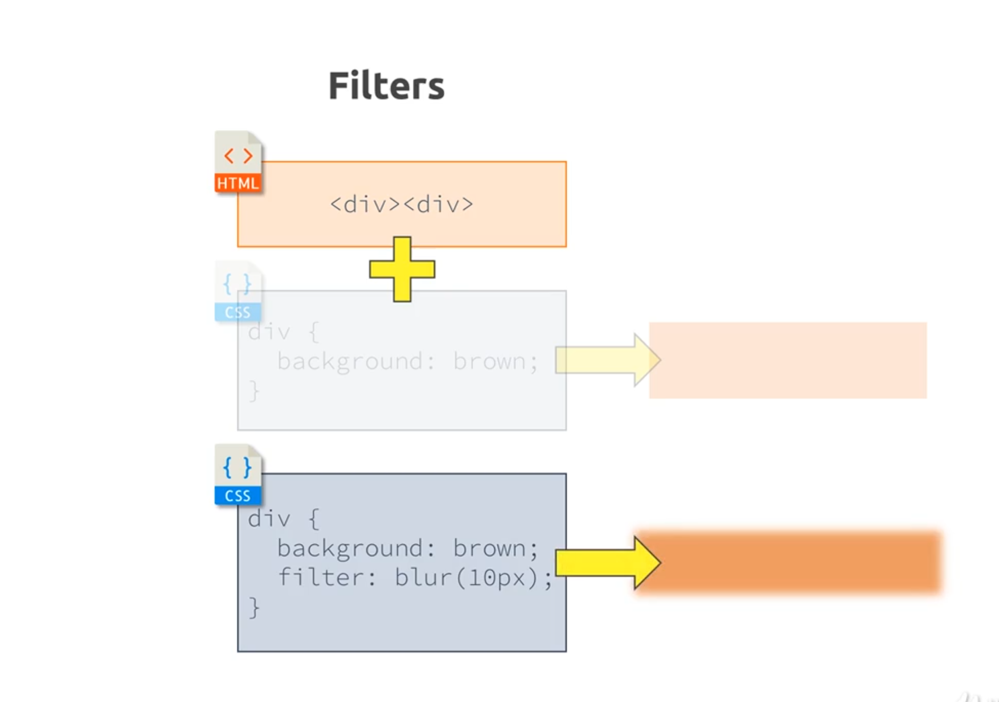

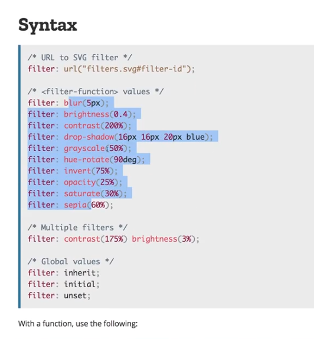

filters quick and easy way changing visuals of something

lets try it on the packages page

```css
.background {
    background: url("../images/plans-background.jpg" center/cover);
    width: 100%;
    height: 100%;
    position: fixed;
    z-index: -1;
    filter: grayscale(40%);
}
```

Adding Styling SVG's
--------------------

can dive very deep into svg - three files attached to this to add to key features page

can copy the svg code into the html

once add them looks like this. they are a little bit too big

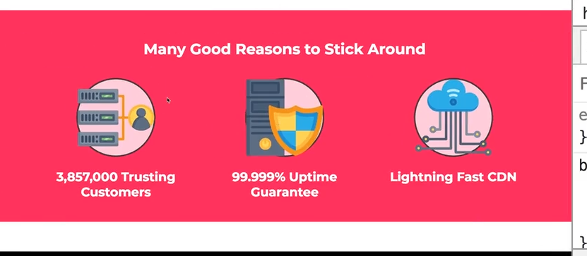

can style svg too- lets target the wrapping container and add a padding

```css
.key-feature__image {
    background: #ffcede;
    width: 128px;
    height: 128px;
    border: 2px solid #424242;
    border-radius: 50%;
    margin: auto;
    padding: 20px;
}
```