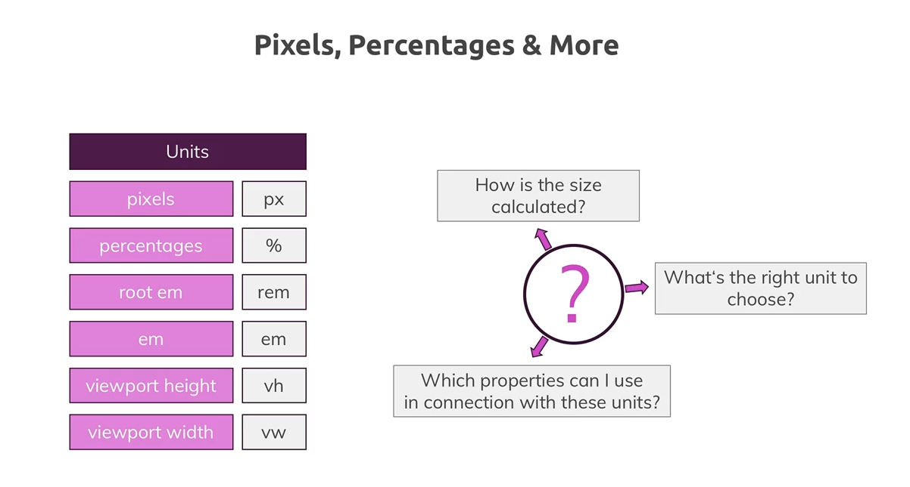
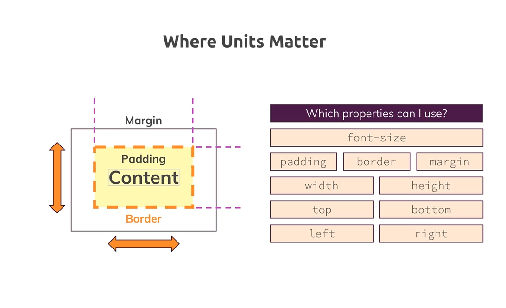
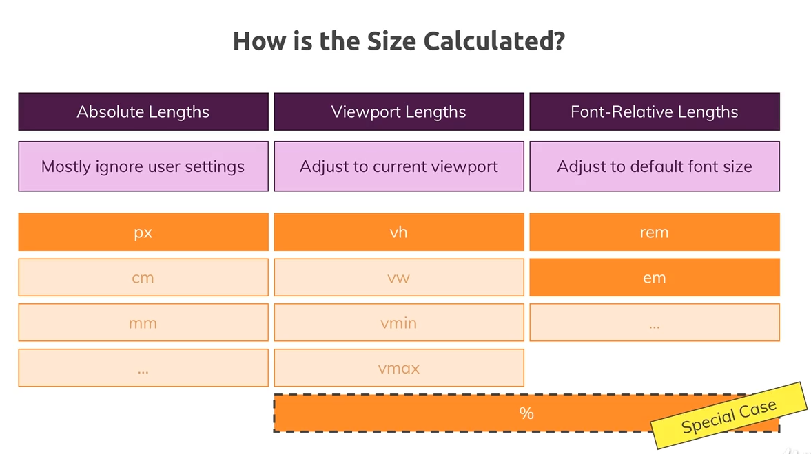
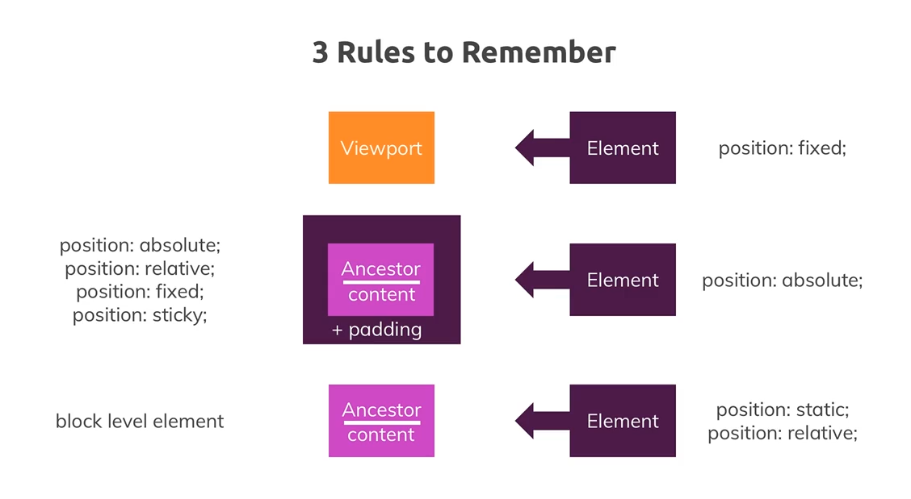

Whats Wrong with Our Project Units
----------------------------------

look at some images they have width 60%, have to look at parent container to see its width and maybe the parent of that parent - css is not about it should do smth like that

want to ensure font size prooporitons are good as well- but using pixels are fixed value and letting borwser zoom doing the work is not the best idea

not best idea to leave it upto the browser

Where Units Matter, Pixels, %’s and More
----------------------------------------

rem is a unit that refers to the font size, em refers to font size as well. but one difference

Overview of Available Size Units
--------------------------------

aboslute lengths ignore user settings- eg if set px and user changes default font size to large then the font size wont change because the user setttings are ignored by the px value- the user can zoom in but this is not the behaviour we want

cm or mm you should not use - on a display 1cm might not be 1cm because different screen sizes can hold different pixel values

rem and em are really the only units need to know for relative lengths

the % values, its a special case bc…

if add 80% width is this 80% of the parent, html or body element?

Rules to Remember Fixed Positioning
-----------------------------------

3 rules to remember:

the posiiton proeprty has an impact how % work

the reference point for an element is called the containing block- a parent element with a width of eg 100px applied- then children would have width of 10px if we applied 10% width

the containing block depends on the posiiton property - if its fized then the containing block is not an element but it is the viewport

an example is our navbar which we set to 100% width - this refers to the viewport

2nd rule

Position: absolute - the containing block is not the viewport but now it is an ancestor - the % now refers to this ancestors content plus the padding

which element is now the containing block? the containing block for an element witht the position absolute is the closests ancestor which is not position static

an example is the slogan

third rule: static positioning or default positioning

the containing block is an ancestor- but this time is it the content of the ancestor- how do we identify the containing the block? simply the closests ancestor which is a block level element

